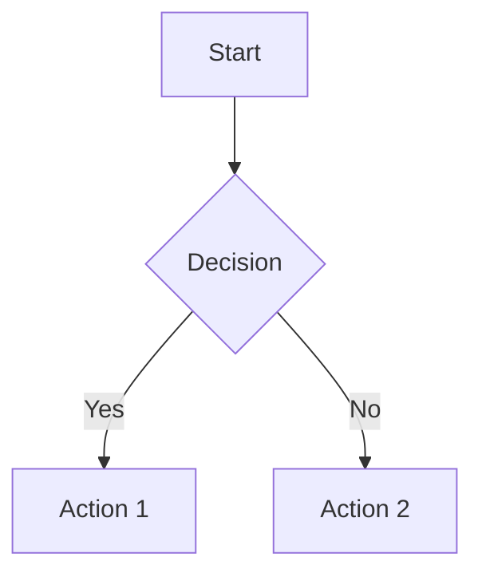

# Markdown Editor Documentation

## Overview

Markdown Editor is a powerful native desktop application for editing and viewing markdown files with real-time preview, syntax highlighting, and advanced features.

## Getting Started

### Opening Files
- **New File**: `Ctrl+N` or click "New" button
- **Open File**: `Ctrl+O` or click "Open" button  
- **Drag & Drop**: Drop `.md` files onto the application window

### Saving Files
- **Save**: `Ctrl+S` or click "Save" button
- **Save As**: `Ctrl+Shift+S` or use Save dropdown arrow

## View Modes

The application offers three distinct view modes:

### Code Mode (`Ctrl+1`)
- Full-screen Monaco editor with syntax highlighting
- Markdown formatting toolbar (when enabled)
- Line numbers and code folding

### Preview Mode (`Ctrl+2`) 
- Real-time rendered markdown preview
- GitHub-flavored markdown support
- Math expressions and diagrams

### Split Mode (`Ctrl+3`)
- Side-by-side editor and preview
- Synchronized scrolling
- Resizable panes with splitter

## Features

### Markdown Formatting Toolbar
- **Toggle**: `Ctrl+Shift+M` or Settings
- **Headers**: H1, H2, H3 buttons
- **Text Formatting**: Bold (`Ctrl+B`), Italic (`Ctrl+I`), Underline, Strikethrough
- **Lists**: Bullet lists, numbered lists, task lists
- **Elements**: Links, images, tables, horizontal rules, blockquotes

### Advanced Rendering
- **Math Expressions**: Use `$inline math$` and `$$display math$$`
- **Mermaid Diagrams**: Use ```mermaid code blocks
- **Task Lists**: Interactive checkboxes with state persistence
- **Syntax Highlighting**: Code blocks with language detection

### Themes
- **Light Theme**: Clean, GitHub-style appearance
- **Dark Theme**: Easy on the eyes for low-light environments
- **Toggle**: `Ctrl+T` or theme button

### Distraction-Free Mode
- **Activate**: `F11` or distraction-free button
- **Exit**: `Esc` or `F11`
- **Features**: Hides all UI elements except content
- **Responsive**: Adapts to different screen sizes

### Centered Layout
- **A4 Page Width**: Professional document appearance
- **Multiple Sizes**: A4, Letter, Legal page formats
- **Configurable Margins**: Customizable spacing
- **Print Consistency**: WYSIWYG printing

### File History
- **Recent Files**: Shows last 3 opened files on welcome screen
- **Quick Access**: Click to reopen recent documents
- **Clear History**: Remove all history entries

## Export Options

### HTML Export (`Ctrl+Shift+E`)
- Complete HTML document with embedded styles
- Preserves formatting and styling
- Includes math expressions and diagrams

### PDF Export (`Ctrl+P`)
- Print current view to PDF
- Respects centered layout settings
- Optimized for different page sizes

## Keyboard Shortcuts

### File Operations
- `Ctrl+N` - New file
- `Ctrl+O` - Open file
- `Ctrl+S` - Save file
- `Ctrl+Shift+S` - Save as
- `Ctrl+W` - Close file
- `Ctrl+Q` - Quit application

### View Modes
- `Ctrl+1` - Code mode
- `Ctrl+2` - Preview mode
- `Ctrl+3` - Split mode
- `F11` - Distraction-free mode
- `Esc` - Exit distraction-free mode

### Editor Shortcuts
- `Ctrl+B` - Bold text
- `Ctrl+I` - Italic text
- `Ctrl+Shift+1-3` - Headers H1-H3
- `Ctrl+Shift+M` - Toggle markdown toolbar
- `Ctrl+F` - Find
- `Ctrl+Shift+H` - Find and replace

### Application
- `Ctrl+T` - Toggle theme
- `Ctrl+,` - Settings
- `F1` - Help
- `F5` - Refresh preview

## Settings

Access settings via `Ctrl+,` or the Settings button:

### Appearance
- **Theme**: Light or Dark
- **Centered Layout**: Enable/disable A4 layout
- **Page Size**: A4, Letter, or Legal

### Editor
- **Default Mode**: Startup view mode
- **Text Suggestions**: Monaco editor suggestions
- **Markdown Toolbar**: Show/hide formatting toolbar

### Performance
- Real-time performance metrics
- System information display
- Memory usage monitoring

## Tips & Tricks

### Drag & Drop
- **Welcome Screen**: Drop `.md` files to open them
- **Code Mode**: Drop any files to insert their absolute paths
- **Other Modes**: Switch to Code mode first

### Task Lists
- Create with `- [ ] Task item` syntax
- Click checkboxes in preview to toggle completion
- State persists when saving the file

### Math Expressions
- **Inline**: `$E = mc^2$`
- **Display**: `$$\int_{-\infty}^{\infty} e^{-x^2} dx = \sqrt{\pi}$$`

### Mermaid Diagrams


### Auto-List Continuation
- Press `Enter` in a list to continue the list
- Press `Enter` on empty list item to end the list
- Works with bullet lists, numbered lists, and task lists

## Troubleshooting

### Performance Issues
- Check Settings > Performance for metrics
- Disable markdown toolbar if not needed
- Use Code mode for large files

### File Association
- The application registers for `.md`, `.markdown`, and `.txt` files
- Double-click supported files to open in Markdown Editor

### Image Display
- Local images are converted to data URLs for display
- Remote images (HTTP/HTTPS) load directly
- Supported formats: PNG, JPG, GIF, WebP, SVG

## System Requirements

- **Windows**: Windows 10 (1903) or later
- **macOS**: macOS 10.13 (High Sierra) or later  
- **Linux**: Ubuntu 18.04, Debian 10, or equivalent
- **RAM**: 4GB minimum, 8GB recommended
- **Storage**: 100MB free space

## Version Information

**Current Version**: 2.0.0  
**Built With**: Tauri + Rust + TypeScript  
**License**: MIT License

For more information, visit: https://github.com/travelingbear/markdown-editor