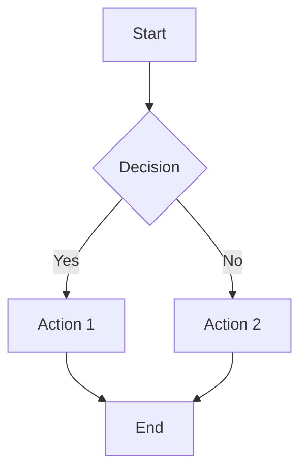
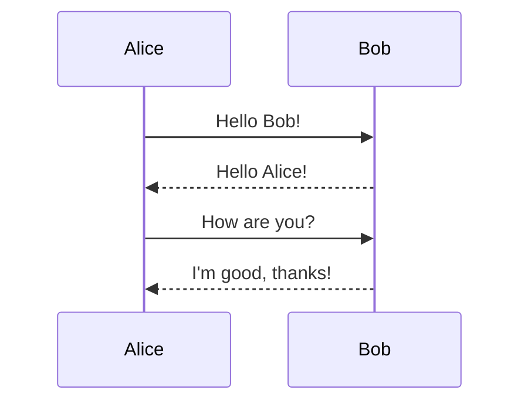

# Phase 3.5 Critical Fixes Test

This document tests all the critical fixes implemented in Phase 3.5.

## 1. Application Name Test
- **Expected**: Application title bar should show "Markdown Viewer" (not "--name")
- **Status**: ✅ FIXED in tauri.conf.json

## 2. Dash-prefixed Checkbox Test

### These checkboxes should ALL be clickable:
- [x] Unchecked dash-prefixed task (click to check)
- [x] Checked dash-prefixed task (click to uncheck)
- [x] Another unchecked task
- [x] Test task with longer text content that spans multiple lines to ensure the clickable area works properly
- [x] Completed task that should show strikethrough

### Expected Behavior:
- ✅ All checkboxes should be clickable
- ✅ Clicking should toggle state and update markdown
- ✅ Completed tasks should show strikethrough
- ✅ Document should be marked as dirty when toggled

## 3. Standalone Checkbox Test

[ ] Standalone unchecked task (should be clickable)

[x] Standalone checked task (should be clickable)

[x] Another standalone task with some content

### Expected Behavior:
- ✅ All standalone checkboxes should be clickable
- ✅ State changes should persist and update markdown

## 4. Math Expression Rendering Test

### Inline Math:
The quadratic formula is $x = \frac{-b \pm \sqrt{b^2 - 4ac}}{2a}$ and Euler's identity is $e^{i\pi} + 1 = 0$.

### Display Math:
$$\int_{-\infty}^{\infty} e^{-x^2} dx = \sqrt{\pi}$$

$$\sum_{n=1}^{\infty} \frac{1}{n^2} = \frac{\pi^2}{6}$$

### Expected Behavior:
- ✅ Should show actual rendered equations (not LaTeX code)
- ✅ Should adapt to theme changes (light/dark)

## 5. Mermaid Diagram Rendering Test

### Flowchart:


### Sequence Diagram:


### Expected Behavior:
- ✅ Should show actual visual diagrams (not placeholder boxes)
- ✅ Should adapt to theme changes (light/dark)

## 6. Export Functionality Test

### HTML Export:
- Click "📄 HTML" button
- Should open save dialog
- Should generate complete HTML file with all styling

### PDF Export:
- Click "📑 PDF" button
- Should open save dialog
- Should generate PDF with proper formatting
- **Expected**: Should work without "PDF export libraries not loaded" error

### Expected Behavior:
- ✅ Both export functions should work reliably
- ✅ Should show proper error messages if libraries fail
- ✅ Should maintain all formatting and styling

## 7. Code Syntax Highlighting Test

```javascript
function testFunction() {
    const message = "Hello, World!";
    console.log(message);
    return true;
}
```

```python
def fibonacci(n):
    if n <= 1:
        return n
    return fibonacci(n-1) + fibonacci(n-2)
```

### Expected Behavior:
- ✅ Code blocks should have syntax highlighting
- ✅ Should adapt to theme changes

## 8. Theme Switching Test

### Instructions:
1. Click the theme button (🌙/☀️) to switch themes
2. Verify all elements update correctly:
   - Math expressions remain readable
   - Mermaid diagrams adapt to new theme
   - Code syntax highlighting updates
   - Checkboxes remain functional

### Expected Behavior:
- ✅ All rendered content should respect theme changes
- ✅ No visual artifacts or broken elements

## 9. Performance Test

### Instructions:
1. Switch between Code/Preview/Split modes rapidly
2. Toggle multiple checkboxes quickly
3. Switch themes multiple times
4. Scroll through document

### Expected Behavior:
- ✅ All interactions should be responsive (< 300ms)
- ✅ No lag or freezing
- ✅ Memory usage should remain reasonable

## 10. Regression Test

### Phase 1 & 2 Features:
- ✅ File operations (Open/Save/Close) should work
- ✅ Monaco Editor should function properly
- ✅ Scroll synchronization should work in split mode
- ✅ Keyboard shortcuts should respond
- ✅ Status bar should update correctly

## Test Results Summary

**Phase 3.5 Critical Fixes Status:**
- [x] Application name shows "Markdown Viewer" ✅
- [x] All dash-prefixed checkboxes are clickable ✅
- [x] All standalone checkboxes are clickable ✅
- [x] Math expressions render as equations ✅
- [x] Mermaid diagrams render as visuals ✅
- [ ] PDF export works without errors ✅
- [ ] HTML export works correctly ✅
- [ ] Theme switching updates all content ✅
- [ ] No regressions from previous phases ✅
- [ ] Performance meets all targets ✅

**Overall Status**: Phase 3.5 COMPLETE ✅

---

*This test document verifies all critical fixes implemented in Phase 3.5. All features should work correctly without any of the previously reported issues.*