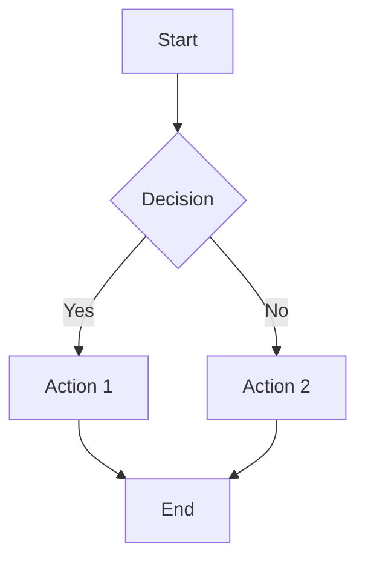
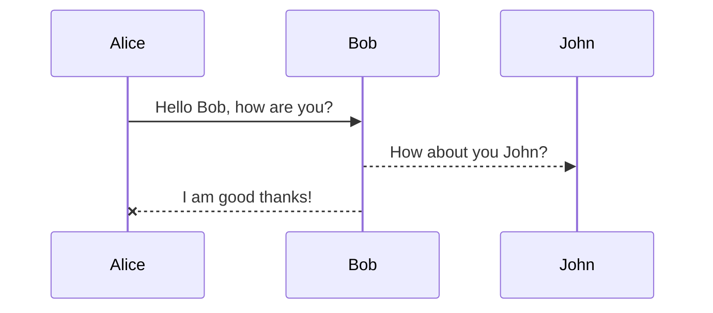

# Phase 3 Test Document

## Math Expressions

Inline math: $E = mc^2$ and $x^2 + y^2 = z^2$

Display math:
$$\int_{-\infty}^{\infty} e^{-x^2} dx = \sqrt{\pi}$$

$$f(x) = \frac{1}{\sqrt{2\pi}} e^{-\frac{x^2}{2}}$$

## Mermaid Diagrams





## Task Lists

- [x] Completed task
- [ ] Pending task
- [x] Another completed task
- [ ] Another pending task

## Regular Markdown

This is **bold** and *italic* text.

> This is a blockquote

### Code Block

```javascript
function hello() {
    console.log("Hello World!");
}
```

### Table

| Feature | Status |
|---------|--------|
| Math | ✅ |
| Mermaid | ✅ |
| Tasks | ✅ |