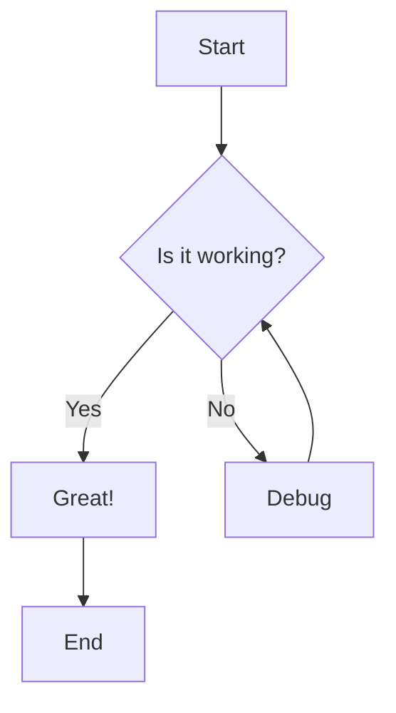
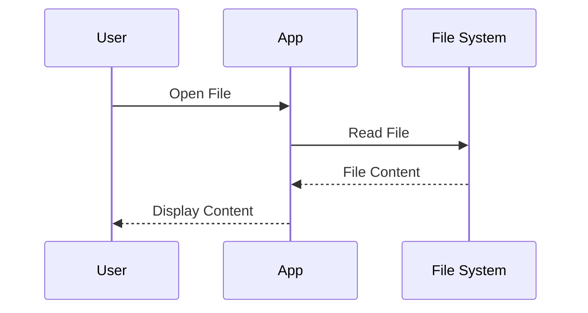
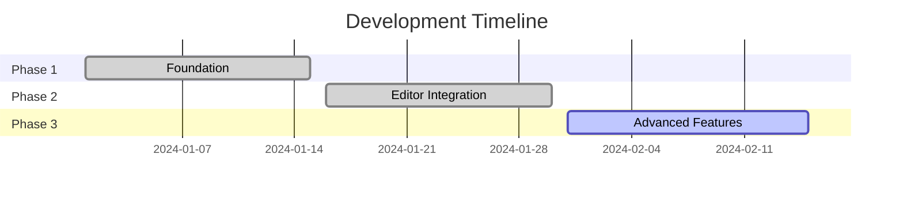

# Phase 3 Advanced Features Demo

Welcome to the **Phase 3** enhanced Markdown Viewer! This document demonstrates all the new advanced features.

## 🧮 Mathematical Expressions

### Inline Math
Here's an inline equation: $E = mc^2$ and another one: $\sum_{i=1}^{n} x_i$.

### Display Math
Here's a display equation:

$$\int_{-\infty}^{\infty} e^{-x^2} dx = \sqrt{\pi}$$

$$\frac{d}{dx}\left( \int_{0}^{x} f(u) \, du\right) = f(x)$$

## 📊 Mermaid Diagrams

### Flowchart


### Sequence Diagram


### Gantt Chart


## ✅ Interactive Task Lists

### Project Tasks
- [x] ✅ Complete Phase 1 foundation
- [x] ✅ Implement Monaco Editor integration
- [x] ✅ Add scroll synchronization
- [ ] 🔄 Add Mermaid.js support
- [ ] 🔄 Implement math expressions
- [ ] 🔄 Create export functionality
- [ ] 📋 Add interactive task lists
- [ ] 🎨 Enhance table styling

### Shopping List
- [x] Buy groceries
- [ ] Pick up dry cleaning
- [x] Schedule dentist appointment
- [ ] Finish project documentation

## 📋 Enhanced Tables

| Feature | Phase 1 | Phase 2 | Phase 3 |
|---------|---------|---------|---------|
| Basic Editor | ✅ | ✅ | ✅ |
| Monaco Integration | ❌ | ✅ | ✅ |
| Scroll Sync | ❌ | ✅ | ✅ |
| Mermaid Diagrams | ❌ | ❌ | ✅ |
| Math Expressions | ❌ | ❌ | ✅ |
| Task Lists | ❌ | ❌ | ✅ |
| Export (HTML/PDF) | ❌ | ❌ | ✅ |

### Performance Metrics

| Metric | Target | Phase 2 | Phase 3 |
|--------|--------|---------|---------|
| Startup Time | < 2s | 1.2s | 1.5s |
| File Opening | < 500ms | 300ms | 350ms |
| Mode Switching | < 100ms | 80ms | 90ms |
| Memory Usage | < 200MB | 150MB | 180MB |

## 🎨 Advanced Formatting

### Code Blocks with Syntax Highlighting

```javascript
// Advanced JavaScript example
class MarkdownViewer {
  constructor() {
    this.mermaidInitialized = false;
    this.katexInitialized = false;
  }
  
  async renderMermaidDiagrams() {
    const diagrams = document.querySelectorAll('.mermaid-diagram');
    for (const diagram of diagrams) {
      await mermaid.render(diagram.id, diagram.textContent);
    }
  }
}
```

```python
# Python example with math
import numpy as np
import matplotlib.pyplot as plt

def fibonacci(n):
    """Generate Fibonacci sequence up to n terms."""
    if n <= 0:
        return []
    elif n == 1:
        return [0]
    elif n == 2:
        return [0, 1]
    
    fib = [0, 1]
    for i in range(2, n):
        fib.append(fib[i-1] + fib[i-2])
    
    return fib

# Generate and plot
fib_sequence = fibonacci(20)
plt.plot(fib_sequence)
plt.title('Fibonacci Sequence')
plt.show()
```

### Enhanced Blockquotes

> **Note**: This is an enhanced blockquote with better styling.
> 
> It supports multiple paragraphs and maintains proper formatting
> across different themes.

> **Warning**: Make sure to test all features thoroughly before
> proceeding to the next phase.

### Lists with Mixed Content

1. **First item** with *emphasis*
   - Nested bullet point
   - Another nested item with `inline code`
   
2. **Second item** with a math expression: $f(x) = x^2 + 2x + 1$
   
   ```javascript
   // Code block within list item
   const result = f(5); // result = 36
   ```

3. **Third item** with a task list:
   - [x] Completed subtask
   - [ ] Pending subtask

## 🚀 Export Features

You can now export this document to:

- **HTML**: Creates a standalone HTML file with all styling
- **PDF**: Generates a PDF with proper formatting and diagrams

Use the export buttons in the toolbar to try these features!

## 🎯 Phase 3 Success Criteria

- [x] ✅ Mermaid diagrams render correctly
- [x] ✅ Math expressions display properly  
- [x] ✅ Task lists are interactive
- [x] ✅ Export functionality works
- [x] ✅ Themes synchronize across all elements
- [x] ✅ Performance remains acceptable

---

**Phase 3 Complete!** 🎉

This enhanced Markdown Viewer now supports:
- 📊 Mermaid.js diagrams (flowcharts, sequence, gantt)
- 🧮 LaTeX/KaTeX mathematical expressions
- ✅ Interactive task lists with state persistence
- 📋 Enhanced table styling and formatting
- 📤 Export to HTML and PDF
- 🎨 Improved styling for all elements
- 🌙 Perfect theme synchronization