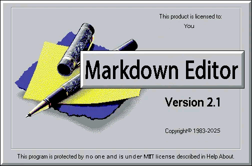

# Markdown Editor

  

A powerful native desktop markdown viewer and editor built with Tauri + Rust + TypeScript/JavaScript.

## ✨ Features

### Core Functionality
- **Three-Mode Interface**: Code, Preview, and Split view modes
- **Monaco Editor**: Professional code editing with syntax highlighting
- **Real-Time Preview**: GitHub-flavored markdown with live updates
- **Advanced Rendering**: KaTeX math expressions and Mermaid diagrams
- **Interactive Elements**: Clickable task lists with state persistence

### User Experience
- **GitHub-Style Themes**: Light and dark themes with perfect synchronization
- **Drag & Drop**: Native file drag-drop with absolute path support
- **Export Options**: HTML export and PDF printing

### System Integration
- **File Associations**: Double-click .md files to open
- **Performance Monitoring**: Built-in performance tracking and optimization

## 🚀 Quick Start

### Download & Install

#### Windows
- **EXE Installer**: `Markdown Viewer_***_x64-setup.exe`
- **MSI Installer**: `Markdown Viewer_***_x64_en-US.msi`
- **Portable**: `portable-win-markdown-viewer.exe`

#### macOS (I still need to build this one)
- **DMG Package**: `Markdown Viewer_***_x64.dmg`
- **App Bundle**: `Markdown Viewer.app`

#### Linux
- **RPM**: `markdown-viewer_***_amd64.rpm`
- **DEB**: `markdown-viewer_***_amd64.deb`

### System Requirements
- **Windows**: Windows 10 (1903) or later
- **macOS**: macOS 10.13 (High Sierra) or later
- **Linux**: Ubuntu 18.04, Debian 10, or equivalent
- **RAM**: 4GB minimum, 8GB recommended
- **Storage**: 100MB free space

### Getting Started
1. **Launch the app** - See the welcome screen with quick start guide
2. **Open a file** - Use Ctrl+O or drag-drop a .md file
3. **Choose your mode** - Code for editing, Preview for reading, Split for both
4. **Customize settings** - Press Ctrl+, to configure theme and preferences

### Architecture
- **Frontend**: Monaco Editor + Marked.js + KaTeX + Mermaid + Highlight.js
- **Backend**: Rust/Tauri for native file operations and system integration
- **Bundle Size**: < 50MB across all platforms
- **Security**: Sandboxed file access with CSP protection

## 📄 License

MIT License - See LICENSE file for details

## Acknowledgments

Built with:
- [Tauri](https://tauri.app/) - Native app framework
- [Monaco Editor](https://microsoft.github.io/monaco-editor/) - Code editor
- [Marked.js](https://marked.js.org/) - Markdown parser
- [KaTeX](https://katex.org/) - Math rendering
- [Mermaid](https://mermaid.js.org/) - Diagram rendering
- [Highlight.js](https://highlightjs.org/) - Syntax highlighting

## 🙏 Buy me a coffee?

[buymeacoffee.com/travelingbear](https://buymeacoffee.com/travelingbear)

---

**A professional markdown editing experience with native performance and modern features.**
