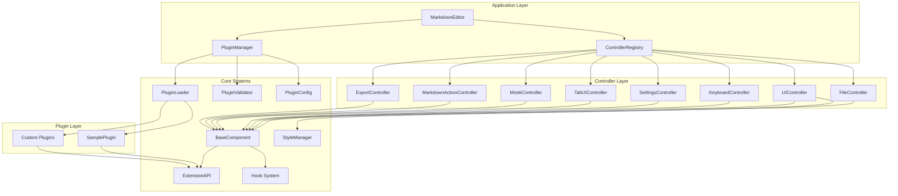
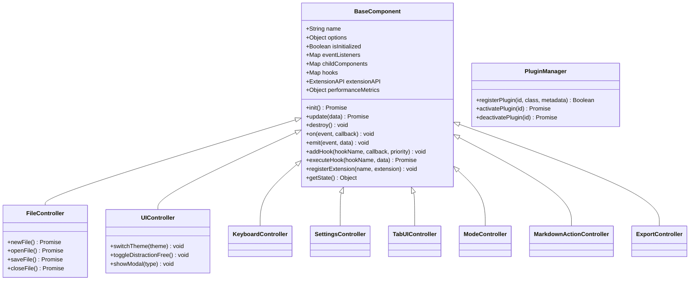
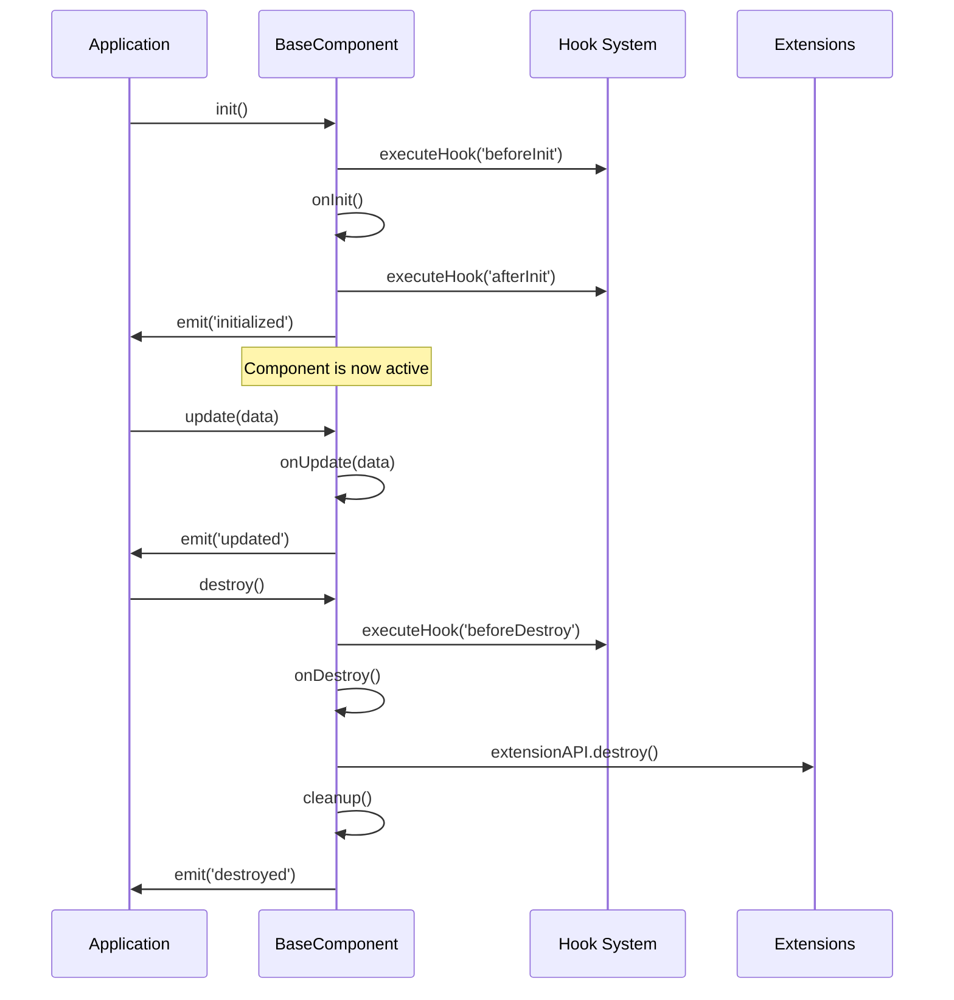
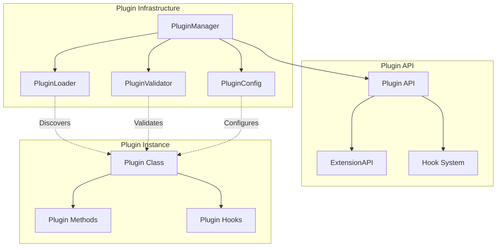

# Markdown Editor - Complete Technical Documentation

## Table of Contents

1. [Architecture Overview](#architecture-overview)
2. [Component System](#component-system)
3. [Controller Architecture](#controller-architecture)
4. [Plugin System](#plugin-system)
5. [Extension Points](#extension-points)
6. [Hook System](#hook-system)
7. [CSS Architecture](#css-architecture)
8. [Building and Development](#building-and-development)
9. [Plugin Development Guide](#plugin-development-guide)
10. [CSS Development Guide](#css-development-guide)
11. [API Reference](#api-reference)
12. [Performance Considerations](#performance-considerations)

---

## Architecture Overview

The Markdown Editor has been refactored from a monolithic structure into a modular, plugin-ready architecture. This transformation enables extensibility, maintainability, and scalability while preserving all original functionality.



### Key Architectural Principles

**Separation of Concerns**: Each controller handles a specific domain (files, UI, keyboard, etc.)

**Dependency Injection**: Controllers are injected into MarkdownEditor, enabling testing and customization

**Plugin Architecture**: Extensible system allowing third-party functionality without core modifications

**Hook System**: Event-driven architecture enabling plugins to react to application events

**Component Lifecycle**: Standardized initialization, update, and destruction patterns

**Dynamic CSS Loading**: Modular CSS architecture with on-demand theme and feature loading

---

## Component System

### BaseComponent Class

All controllers inherit from `BaseComponent`, providing standardized functionality:



### Component Lifecycle

Every component follows a standardized lifecycle:



---

## Controller Architecture

### Complete Controller Responsibilities

Each controller manages a specific aspect of the application:

**FileController** (`src/components/controllers/FileController.js` - 187 lines)
- File operations (new, open, save, close)
- Drag & drop handling
- File associations and startup files
- Recent files management

**UIController** (`src/components/controllers/UIController.js` - Completed)
- Theme management (light, dark, retro, contrast)
- Modal dialogs (settings, help, about)
- Distraction-free mode
- Layout controls

**KeyboardController** (`src/components/controllers/KeyboardController.js` - Completed)
- All application keyboard shortcuts
- Tab navigation shortcuts (Ctrl+Tab, Alt+1-9)
- Mode switching shortcuts (Ctrl+1,2,3)
- File operations (Ctrl+N,O,S)
- Find functionality (Ctrl+F)

**SettingsController** (`src/components/controllers/SettingsController.js` - Completed)
- Settings persistence (localStorage)
- Performance monitoring
- Configuration management
- Settings UI integration

**TabUIController** (`src/components/controllers/TabUIController.js` - Completed)
- Tab dropdown management (recent 9 tabs)
- Tab modal for all tabs with search
- Context menu operations (move, close, duplicate, pin)
- Pinned tabs functionality
- Tab keyboard navigation (Alt+1-9)

**ModeController** (`src/components/controllers/ModeController.js` - 198 lines)
- View mode switching (code/preview/split)
- Scroll position management
- Layout updates
- Monaco editor integration

**MarkdownActionController** (`src/components/controllers/MarkdownActionController.js` - 495 lines)
- Markdown formatting (bold, italic, headers)
- Text insertion and manipulation
- Task list interactions
- Multi-line operations

**ExportController** (`src/components/controllers/ExportController.js` - 154 lines)
- HTML export
- PDF printing
- Export dialogs
- Print optimization

---

## Plugin System

### Plugin Architecture Overview

The plugin system enables third-party extensions without modifying core code:



### Plugin Structure

Every plugin must follow this structure:

```javascript
class MyPlugin {
  constructor(pluginAPI) {
    this.pluginAPI = pluginAPI;
    // Plugin initialization
  }

  async init() {
    // Plugin activation logic
    // Register hooks, add UI elements, etc.
  }

  async destroy() {
    // Plugin cleanup logic
    // Remove UI elements, unregister hooks, etc.
  }
}

// Required metadata
MyPlugin.metadata = {
  name: 'My Plugin',
  version: '1.0.0',
  description: 'Plugin description',
  author: 'Author Name'
};
```

---

## Extension Points

### Controller Extension Points

Each controller provides specific extension points:

**FileController Extensions**
- Custom file formats
- Additional file operations
- File processing pipelines
- Import/export filters

**UIController Extensions**
- Custom themes
- Additional UI components
- Layout modifications
- Modal dialogs

**MarkdownActionController Extensions**
- Custom formatting actions
- Text processing functions
- Syntax extensions
- Editor enhancements

---

## Hook System

### Complete Hook List by Controller

**FileController Hooks**
- `beforeNewFile` - Before creating new file
- `afterNewFile` - After new file created
- `beforeOpenFile` - Before opening file
- `afterOpenFile` - After file opened
- `beforeSaveFile` - Before saving file
- `afterSaveFile` - After file saved
- `beforeCloseFile` - Before closing file
- `afterCloseFile` - After file closed

**UIController Hooks**
- `beforeThemeChange` - Before theme switch
- `afterThemeChange` - After theme switched
- `beforeModalShow` - Before modal display
- `afterModalShow` - After modal displayed
- `beforeModalHide` - Before modal hidden
- `afterModalHide` - After modal hidden

**KeyboardController Hooks**
- `beforeShortcut` - Before keyboard shortcut execution
- `afterShortcut` - After keyboard shortcut executed

**SettingsController Hooks**
- `beforeSettingsLoad` - Before settings loaded
- `afterSettingsLoad` - After settings loaded
- `beforeSettingsSave` - Before settings saved
- `afterSettingsSave` - After settings saved

**TabUIController Hooks**
- `beforeTabSwitch` - Before tab switch
- `afterTabSwitch` - After tab switched
- `beforeTabClose` - Before tab close
- `afterTabClose` - After tab closed

**ModeController Hooks**
- `beforeModeChange` - Before view mode change
- `afterModeChange` - After view mode changed

**MarkdownActionController Hooks**
- `beforeFormatText` - Before text formatting
- `afterFormatText` - After text formatted
- `beforeInsertText` - Before text insertion
- `afterInsertText` - After text inserted

**ExportController Hooks**
- `beforeExport` - Before export operation
- `afterExport` - After export completed

---

## CSS Architecture

### Dynamic CSS Loading System

The Markdown Editor uses a **Dynamic CSS Loading Architecture** that separates core styles from themes and features:

### 🎯 Core Philosophy
- **Lean Core**: Main `styles.css` contains only essential layout and light theme
- **Dynamic Loading**: Themes and features load on-demand
- **Modular Design**: Each theme/feature in separate files
- **Performance First**: Only load what's needed when needed

### 📁 File Structure
```
src/
├── styles.css                    # Core styles (~500 lines)
├── core/
│   └── StyleManager.js           # Dynamic loading system
└── styles/
    ├── themes/                   # Theme files
    │   ├── dark.css             # Dark theme
    │   ├── retro.css            # Windows 3.1 retro theme
    │   └── contrast.css         # High contrast theme
    ├── features/                 # Feature-specific styles
    │   ├── markdown-toolbar.css # Markdown toolbar
    │   ├── settings-modal.css   # Settings modal
    │   └── tab-system.css       # Tab management UI
    └── utilities/                # Utility styles
        └── print.css            # Print-specific styles
```

### StyleManager API

```javascript
// Theme Management
await styleManager.loadTheme('dark');        // Load dark theme
await styleManager.preloadTheme('retro');    // Preload for faster switching

// Feature Loading
await styleManager.loadMarkdownToolbar();    // Load toolbar styles
await styleManager.loadSettingsModal();      // Load modal styles
await styleManager.loadTabSystem();          // Load tab system styles
await styleManager.loadPrintStyles();        // Load print styles

// Utility Methods
styleManager.isFeatureLoaded('print');       // Check if feature loaded
styleManager.unloadFeature('modal');         // Unload feature
styleManager.getPerformanceMetrics();        // Get loading stats
```

### CSS Variables System

All themes use the same CSS variable names for consistency:

```css
:root {
  /* Background Colors */
  --bg-primary: #ffffff;
  --bg-secondary: #f8f9fa;
  --bg-tertiary: #e9ecef;
  
  /* Text Colors */
  --text-primary: #212529;
  --text-secondary: #6c757d;
  --text-muted: #adb5bd;
  
  /* Border Colors */
  --border-color: #dee2e6;
  --border-hover: #adb5bd;
  
  /* Interactive Colors */
  --accent-color: #007bff;
  --accent-hover: #0056b3;
  --success-color: #28a745;
  --warning-color: #ffc107;
  --danger-color: #dc3545;
}
```

---

## Building and Development

### Complete Project Structure

```
markdown-editor/
├── Markdown Viewer/                          # Main application directory
│   ├── scripts/
│   │   └── analyze-bundle.js                 # Bundle analysis tool
│   ├── src/                                  # Frontend source code
│   │   ├── assets/                          # Static assets
│   │   │   ├── icon.svg                     # Application icon
│   │   │   ├── katex.min.css               # KaTeX math rendering styles
│   │   │   ├── katex.min.js                # KaTeX math rendering library
│   │   │   ├── mermaid.min.js              # Mermaid diagram library
│   │   │   ├── MarkdownEditorAboutImage.png # About dialog image
│   │   │   ├── SplashScreen.gif            # Application splash screen
│   │   │   └── windows95_startup_hifi.*    # Retro theme audio files
│   │   ├── components/                      # Component architecture
│   │   │   ├── controllers/                # Specialized controllers
│   │   │   │   ├── ExportController.js     # HTML/PDF export (154 lines)
│   │   │   │   ├── FileController.js       # File operations (187 lines)
│   │   │   │   ├── KeyboardController.js   # Keyboard shortcuts
│   │   │   │   ├── MarkdownActionController.js # Formatting actions (495 lines)
│   │   │   │   ├── ModeController.js       # View mode switching (198 lines)
│   │   │   │   ├── SettingsController.js   # Settings management
│   │   │   │   ├── TabUIController.js      # Tab UI management
│   │   │   │   └── UIController.js         # Theme and UI management
│   │   │   ├── BaseComponent.js            # Base component class
│   │   │   ├── DocumentComponent.js        # Document state management
│   │   │   ├── EditorComponent.js          # Monaco editor wrapper
│   │   │   ├── MarkdownEditor.js           # Main orchestrator
│   │   │   ├── PreviewComponent.js         # Markdown preview renderer
│   │   │   ├── TabCollection.js            # Tab collection management
│   │   │   ├── TabManager.js               # Tab lifecycle management
│   │   │   ├── TabState.js                 # Individual tab state
│   │   │   └── ToolbarComponent.js         # Toolbar UI component
│   │   ├── core/                           # Core systems
│   │   │   ├── ControllerRegistry.js       # Controller dependency injection
│   │   │   ├── ExtensionAPI.js             # Plugin extension system (90 lines)
│   │   │   ├── PluginConfig.js             # Plugin configuration (93 lines)
│   │   │   ├── PluginLoader.js             # Plugin discovery (187 lines)
│   │   │   ├── PluginManager.js            # Plugin lifecycle (187 lines)
│   │   │   ├── PluginValidator.js          # Plugin security validation (166 lines)
│   │   │   └── StyleManager.js             # Dynamic CSS loading
│   │   ├── favicons/                       # Application favicons
│   │   │   ├── favicon.ico                 # Standard favicon
│   │   │   ├── icon.png                    # Application icon
│   │   │   └── web-app-manifest-*.png      # PWA manifest icons
│   │   ├── plugins/                        # Plugin directory
│   │   │   └── SamplePlugin.js             # Example plugin (112 lines)
│   │   ├── styles/                         # Modular CSS architecture
│   │   │   ├── features/                   # Feature-specific styles
│   │   │   │   ├── markdown-toolbar.css    # Toolbar styling
│   │   │   │   ├── settings-modal.css      # Settings modal styling
│   │   │   │   └── tab-system.css          # Tab system styling
│   │   │   ├── themes/                     # Theme files
│   │   │   │   ├── contrast.css            # High contrast theme
│   │   │   │   ├── dark.css                # Dark theme
│   │   │   │   └── retro.css               # Windows 3.1 retro theme
│   │   │   └── utilities/                  # Utility styles
│   │   │       └── print.css               # Print-specific styles
│   │   ├── utils/                          # Utility functions
│   │   │   ├── common.js                   # Common utility functions
│   │   │   └── sanitizer.js                # HTML sanitization
│   │   ├── index.html                      # Main HTML entry point
│   │   ├── ipc-wrapper.js                  # Tauri IPC communication wrapper
│   │   ├── main.js                         # Application initialization
│   │   ├── performance-optimizer.js        # Performance monitoring
│   │   ├── plugin-loader.js                # Plugin loading system
│   │   ├── splash-component.js             # Splash screen component
│   │   ├── styles.css                      # Core CSS
│   │   └── test-extension.js               # Extension testing utilities
│   ├── src-tauri/                          # Rust backend
│   │   ├── capabilities/                   # Tauri capability definitions
│   │   ├── gen/                           # Generated Tauri files
│   │   ├── icons/                         # Application icons
│   │   ├── src/                           # Rust source code
│   │   │   ├── lib.rs                     # Library entry point
│   │   │   └── main.rs                    # Main application entry
│   │   ├── target/                        # Rust build artifacts
│   │   ├── build.rs                       # Build script
│   │   ├── Cargo.lock                     # Dependency lock file
│   │   ├── Cargo.toml                     # Rust dependencies
│   │   ├── icon.png                       # Application icon
│   │   ├── markdown-editor.desktop        # Linux desktop entry
│   │   └── tauri.conf.json               # Tauri configuration
│   ├── Documentation.md                   # Component documentation
│   ├── package.json                       # Node.js dependencies
│   └── package-lock.json                  # Dependency lock file
├── BUILD_GUIDE.md                         # Build instructions
├── CHANGELOG.md                           # Version history
├── LICENSE                                # MIT license
├── MarkdownEditorAboutImage.png          # Application splash image
├── README.md                             # Project overview
├── TECHNICAL_DOCUMENTATION.md            # Complete technical documentation
├── USER_GUIDE.md                         # User guide
└── USER_MANUAL.md                        # Detailed user manual
```

### Development Workflow

**Dynamic Plugin Loading System**
- Plugins load automatically via `knownPlugins` array
- No HTML script tags required
- No compilation or bundling needed
- Development changes visible on browser refresh

**SIMPLIFIED Plugin Development Steps:**
1. Create plugin file in `src/plugins/`
2. Add plugin filename to `knownPlugins` array in `PluginLoader.js`
3. Add class name mapping in `getPluginClassFromGlobal` method
4. Extensions MUST have `metadata` property with `name` field

**Dynamic Loading Architecture:**
- PluginLoader scans `knownPlugins` array
- Scripts loaded dynamically via `document.createElement('script')`
- Plugin classes discovered from global scope
- Automatic validation and registration

---

## Plugin Development Guide

### Creating Your First Plugin

**Step 1: Plugin Class Structure**

```javascript
class MyAwesomePlugin {
  constructor(pluginAPI) {
    this.pluginAPI = pluginAPI;
    this.isActive = false;
    this.toolbarButton = null;
  }

  async init() {
    console.log('[MyAwesomePlugin] Initializing...');
    
    // Add UI elements
    this.addToolbarButton();
    
    // Register hooks
    this.registerHooks();
    
    // Register extensions
    this.registerExtensions();
    
    this.isActive = true;
    console.log('[MyAwesomePlugin] Initialized successfully');
  }

  addToolbarButton() {
    this.toolbarButton = document.createElement('button');
    this.toolbarButton.className = 'toolbar-btn my-plugin-btn';
    this.toolbarButton.innerHTML = '🚀 My Plugin';
    this.toolbarButton.title = 'My Awesome Plugin';
    
    this.toolbarButton.addEventListener('click', () => {
      this.handleButtonClick();
    });
    
    const toolbarRight = document.querySelector('.toolbar-right');
    if (toolbarRight) {
      toolbarRight.appendChild(this.toolbarButton);
    }
  }

  registerHooks() {
    // React to file operations
    this.pluginAPI.addHook('file', 'afterOpenFile', (data) => {
      console.log('[MyAwesomePlugin] File opened:', data.filename);
    });
    
    // React to theme changes
    this.pluginAPI.addHook('ui', 'afterThemeChange', (data) => {
      console.log('[MyAwesomePlugin] Theme changed to:', data.theme);
      this.updateTheme(data.theme);
    });
  }

  registerExtensions() {
    // CORRECT: Extension must have metadata property
    const extension = {
      activate: () => {
        console.log('[MyAwesomePlugin] Extension activated');
      },
      customFormat: (text) => {
        return `**${text}**`; // Bold formatting
      },
      metadata: {
        name: 'myCustomAction',
        description: 'Custom formatting action'
      }
    };
    this.pluginAPI.registerExtension('markdownAction', extension);
  }

  handleButtonClick() {
    const editor = this.pluginAPI.getEditor();
    if (editor && editor.isMonacoLoaded) {
      const position = editor.monacoEditor.getPosition();
      const insertText = '\n<!-- My Awesome Plugin was here! -->\n';
      
      editor.monacoEditor.executeEdits('my-awesome-plugin', [{
        range: new monaco.Range(position.lineNumber, position.column, position.lineNumber, position.column),
        text: insertText
      }]);
    }
  }

  updateTheme(theme) {
    // Update plugin UI based on theme
    if (this.toolbarButton) {
      this.toolbarButton.style.filter = theme === 'dark' ? 'invert(1)' : 'none';
    }
  }

  async destroy() {
    console.log('[MyAwesomePlugin] Destroying...');
    
    // Remove UI elements
    if (this.toolbarButton && this.toolbarButton.parentNode) {
      this.toolbarButton.parentNode.removeChild(this.toolbarButton);
      this.toolbarButton = null;
    }
    
    // IMPORTANT: Unregister extensions
    this.pluginAPI.unregisterExtension('markdownAction', 'myCustomAction');
    
    this.isActive = false;
    console.log('[MyAwesomePlugin] Destroyed successfully');
  }
}

// Required metadata
MyAwesomePlugin.metadata = {
  name: 'My Awesome Plugin',
  version: '1.0.0',
  description: 'An awesome plugin that demonstrates plugin capabilities',
  author: 'Your Name'
};

// Make plugin available globally
window.MyAwesomePlugin = MyAwesomePlugin;
```

**Step 2: Register Plugin in System**

1. **Add to PluginLoader**: Edit `src/core/PluginLoader.js`
```javascript
// Add to knownPlugins array
const knownPlugins = [
  'SamplePlugin.js',
  'MyAwesomePlugin.js'  // Add your plugin here
];
```

2. **Add Class Name Mapping**: Edit `src/core/PluginLoader.js`
```javascript
// Add to classNameMap in getPluginClassFromGlobal method
const classNameMap = {
  'sample-plugin': 'SamplePlugin',
  'my-awesome-plugin': 'MyAwesomePlugin'  // Add your mapping
};
```

**NO HTML CHANGES REQUIRED** - Plugins load dynamically!

### Plugin Security Guidelines

**Allowed Patterns**
- DOM manipulation with specific selectors
- Event listener registration
- CSS injection with style elements
- localStorage access for plugin settings
- Console logging for debugging

**Prohibited Patterns**
- `eval()` function usage
- `Function()` constructor
- `document.write()` calls
- Dynamic `innerHTML` with variables
- `localStorage.clear()` or `sessionStorage.clear()`
- Script tag injection

**COMMON PLUGIN DEVELOPMENT ERRORS TO AVOID:**
- ❌ Extension without `metadata.name` property
- ❌ Not adding plugin to `knownPlugins` array
- ❌ Missing class name mapping in `getPluginClassFromGlobal`
- ❌ Forgetting `unregisterExtension` in `destroy()`
- ❌ Wrong extension object structure
- ❌ Plugin class not available in global scope (`window.PluginName`)

---

## CSS Development Guide

### Creating Your First Theme

**Step 1: Create the theme file**
```css
/* src/styles/themes/ocean.css */
.ocean-theme {
  /* Ocean color palette */
  --bg-primary: #0f172a;
  --bg-secondary: #1e293b;
  --bg-tertiary: #334155;
  
  --text-primary: #f1f5f9;
  --text-secondary: #cbd5e1;
  --text-muted: #94a3b8;
  
  --accent-color: #0ea5e9;
  --accent-hover: #0284c7;
  
  --border-color: #475569;
  --border-hover: #64748b;
}

/* Optional: Component-specific styling */
.ocean-theme .toolbar {
  box-shadow: 0 1px 3px rgba(0, 0, 0, 0.3);
}

.ocean-theme .preview-pane {
  background: linear-gradient(135deg, var(--bg-primary) 0%, var(--bg-secondary) 100%);
}
```

### Creating Custom Features

**Step 1: Create feature CSS**
```css
/* src/styles/features/code-highlighter.css */

.code-highlighter {
  position: relative;
  background: var(--bg-secondary);
  border: 1px solid var(--border-color);
  border-radius: 4px;
  overflow: hidden;
}

.code-highlighter__header {
  background: var(--bg-tertiary);
  padding: 0.5rem 1rem;
  border-bottom: 1px solid var(--border-color);
  display: flex;
  justify-content: space-between;
  align-items: center;
}

.code-highlighter__copy-btn {
  background: var(--accent-color);
  color: white;
  border: none;
  padding: 0.25rem 0.5rem;
  border-radius: 3px;
  cursor: pointer;
  transition: background-color 0.2s;
}

.code-highlighter__copy-btn:hover {
  background: var(--accent-hover);
}
```

**Step 2: Add StyleManager method**
```javascript
// Add to StyleManager class
async loadCodeHighlighter() {
  await this.loadFeature('code-highlighter', 'features');
}
```

### Plugin CSS Integration

```css
/* plugins/myplugin/styles.css */

/* Plugin namespace */
.myplugin-container {
  background: var(--bg-primary);
  color: var(--text-primary);
}

.myplugin-button {
  background: var(--accent-color);
  color: white;
  border: none;
  padding: 0.5rem 1rem;
}

.myplugin-button:hover {
  background: var(--accent-hover);
}

/* Plugin-specific variables if needed */
.myplugin-container {
  --plugin-accent: var(--accent-color);
  --plugin-spacing: 1rem;
}
```

---

## API Reference

### PluginAPI Interface

```typescript
interface PluginAPI {
  // Core Components
  getEditor(): EditorComponent;
  getPreview(): PreviewComponent;
  getToolbar(): ToolbarComponent;
  getTabManager(): TabManager;
  
  // Controllers (all 8 controllers)
  getFileController(): FileController;
  getUIController(): UIController;
  getKeyboardController(): KeyboardController;
  getSettingsController(): SettingsController;
  getTabUIController(): TabUIController;
  getModeController(): ModeController;
  getMarkdownActionController(): MarkdownActionController;
  getExportController(): ExportController;
  
  // Extension System
  registerExtension(controller: string, extension: Extension): boolean;
  
  // Hook System
  addHook(controller: string, hookName: string, callback: Function, priority?: number): boolean;
}
```

### BaseComponent Methods

```typescript
class BaseComponent {
  // Lifecycle
  init(): Promise<void>;
  update(data?: Object): Promise<void>;
  destroy(): void;
  
  // Events
  on(event: string, callback: Function): void;
  off(event: string, callback: Function): void;
  emit(event: string, data?: Object): void;
  
  // Hooks
  addHook(hookName: string, callback: Function, priority?: number): void;
  removeHook(hookName: string, callback: Function): void;
  executeHook(hookName: string, data?: Object): Promise<void>;
  
  // Extensions
  registerExtension(name: string, extension: Extension): void;
  unregisterExtension(name: string): boolean;
  getExtension(name: string): Extension;
  
  // Utilities
  getState(): ComponentState;
  getPerformanceMetrics(): PerformanceMetrics;
}
```

### StyleManager API

```typescript
class StyleManager {
  // Theme Management
  loadTheme(themeName: string): Promise<void>;
  preloadTheme(themeName: string): Promise<void>;
  getCurrentTheme(): string;
  
  // Feature Loading
  loadFeature(featureName: string, category: string): Promise<void>;
  unloadFeature(featureName: string): void;
  isFeatureLoaded(featureName: string): boolean;
  
  // Performance
  getPerformanceMetrics(): StyleMetrics;
  
  // Specific Features
  loadMarkdownToolbar(): Promise<void>;
  loadSettingsModal(): Promise<void>;
  loadTabSystem(): Promise<void>;
  loadPrintStyles(): Promise<void>;
}
```

---

## Performance Considerations

### Component Performance

**Initialization Optimization**
- Lazy loading of heavy components
- Asynchronous initialization
- Performance metric tracking
- Memory usage monitoring

**Update Optimization**
- Debounced updates for frequent changes
- Selective component updates
- Virtual scrolling for large lists
- Efficient DOM manipulation

### Plugin Performance

**Plugin Loading**
- Lazy plugin activation
- Plugin size limits (1MB max)
- Validation caching
- Dependency resolution optimization

**Runtime Performance**
- Hook execution optimization
- Extension method caching
- Event listener management
- Memory leak prevention

### CSS Performance

**Loading Strategy**
- **Core First**: Essential styles load immediately
- **Theme Preloading**: Popular themes preloaded
- **Feature On-Demand**: Features load when needed
- **Smooth Transitions**: CSS transitions for theme switching

**Memory Management**
- **Unload Unused**: Remove feature styles when not needed
- **Cache Preloaded**: Keep popular themes in memory
- **Lazy Loading**: Load features only when components initialize

### Performance Monitoring

```javascript
// Get component performance metrics
const metrics = component.getPerformanceMetrics();
console.log('Init time:', metrics.initTime);
console.log('Average update time:', metrics.averageUpdateTime);
console.log('Update count:', metrics.updateCount);

// Monitor plugin performance
const activePlugins = pluginManager.getActivePlugins();
const allPlugins = pluginManager.getAllPlugins();
console.log('Active plugins:', activePlugins.length);
console.log('Total plugins:', allPlugins.length);

// CSS performance metrics
const cssMetrics = styleManager.getPerformanceMetrics();
console.log('Loaded themes:', cssMetrics.loadedThemes);
console.log('Loaded features:', cssMetrics.loadedFeatures);
console.log('Total stylesheets:', cssMetrics.totalStylesheets);
```

---

## Conclusion

This comprehensive technical documentation covers the complete architecture of the Markdown Editor, including:

- **Modular Architecture**: 8 specialized controllers extracted from monolithic design
- **Plugin System**: Complete plugin infrastructure with validation and configuration
- **Dynamic CSS**: On-demand loading architecture for themes and features
- **Extension Points**: 20+ hooks and extension points across controllers
- **Performance Optimization**: Memory management and loading strategies
- **Development Guides**: Practical examples for plugins, themes, and features

The architecture supports future enhancements while maintaining backward compatibility and ensuring robust performance across all supported platforms.

**Total Refactoring Achievement:**
- ~1000+ lines reduced from MarkdownEditor.js
- 8 specialized controllers extracted
- Complete plugin infrastructure implemented
- Dynamic CSS loading system
- Hook system with comprehensive extension points
- Security validation and configuration system
- Performance monitoring and memory management

For additional information, refer to the source code comments and the REFACTORING_PLAN.md document for detailed implementation history.

---

## Appendix

### A. File Size Reference

**Core Controllers (Post-Refactoring)**
- `FileController.js`: 187 lines
- `ModeController.js`: 198 lines  
- `MarkdownActionController.js`: 495 lines
- `ExportController.js`: 154 lines
- `UIController.js`: Completed
- `KeyboardController.js`: Completed
- `SettingsController.js`: Completed
- `TabUIController.js`: Completed

**Plugin System**
- `PluginManager.js`: 187 lines
- `PluginLoader.js`: 187 lines
- `PluginValidator.js`: 166 lines
- `SamplePlugin.js`: 112 lines
- `PluginConfig.js`: 93 lines
- `ExtensionAPI.js`: 90 lines

**CSS Architecture**
- `styles.css`: ~500 lines (core only)
- Total extracted CSS: ~1000+ lines to modular files

### B. Performance Benchmarks

**Application Performance**
- Startup time: <60ms
- File operations: <500ms
- Tab switching: <35ms
- Tab limit: 50 tabs with warnings at 45
- Bundle size: <50MB across all platforms

**Memory Management**
- Smart tab virtualization
- Memory pressure detection
- Dynamic CSS loading
- Plugin size limit: 1MB

### C. Security Features

**Plugin Security**
- Comprehensive validation patterns
- Sandboxed execution environment
- Size and metadata validation
- Prohibited pattern detection

**Application Security**
- CSP (Content Security Policy) protection
- Sandboxed file access
- Input sanitization
- Secure IPC communication

### D. Browser Compatibility

**Supported Platforms**
- Windows 10 (1903) or later
- macOS 10.13 (High Sierra) or later
- Ubuntu 18.04, Debian 10, or equivalent

**Required Features**
- ES6+ JavaScript support
- CSS Grid and Flexbox
- Web Components (optional)
- File System Access API (Tauri)

### E. Development Tools

**Available Scripts**
- `npm run tauri dev` - Development mode
- `npm run tauri build` - Production build
- `scripts/analyze-bundle.js` - Bundle analysis

**Debugging Tools**
- Performance monitoring dashboard
- Plugin validation console
- CSS loading metrics
- Component state inspection

### F. Extension Points Summary

**Total Hook Points**: 20+
- FileController: 8 hooks
- UIController: 6 hooks  
- KeyboardController: 2 hooks
- SettingsController: 4 hooks
- TabUIController: 4 hooks
- ModeController: 2 hooks
- MarkdownActionController: 4 hooks
- ExportController: 2 hooks

**Extension Types**
- File format handlers
- UI components and themes
- Markdown formatting actions
- Export formats
- Keyboard shortcuts
- Custom workflows

### G. Version History

**Major Milestones**
- v3.0.0: Multi-tab interface and performance optimization
- v3.1.x: Enhanced tab management and UI improvements
- v3.2.0: Complete architecture refactoring and plugin system

**Refactoring Achievement**
- Lines reduced from MarkdownEditor.js: ~1000+
- Controllers extracted: 8 specialized controllers
- Plugin infrastructure: Complete with validation
- CSS architecture: Dynamic loading system
- Performance improvements: Startup and memory optimization

### H. Future Roadmap

**Planned Enhancements**
- Plugin marketplace integration
- Advanced theme system
- Collaborative editing features
- Enhanced export formats
- Mobile responsive design
- Cloud synchronization

**Architecture Evolution**
- Web Components migration
- Service Worker integration
- Progressive Web App features
- Enhanced security model
- Performance optimizations