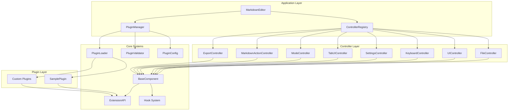
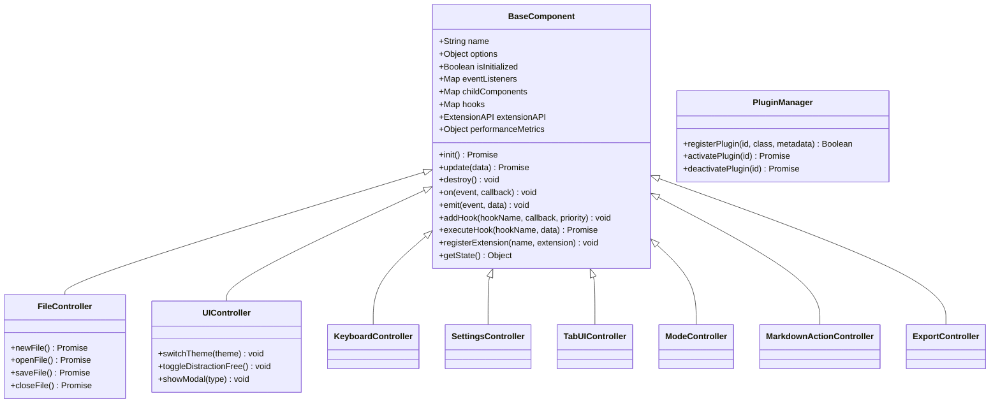
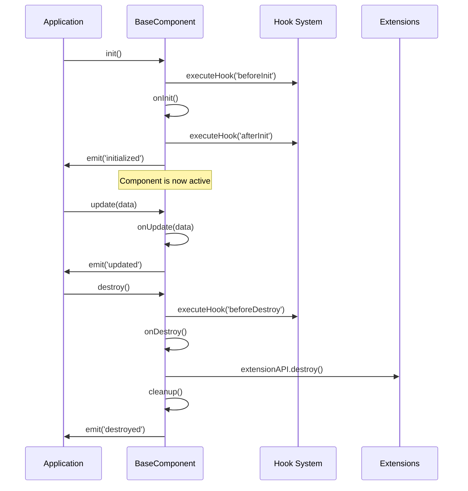
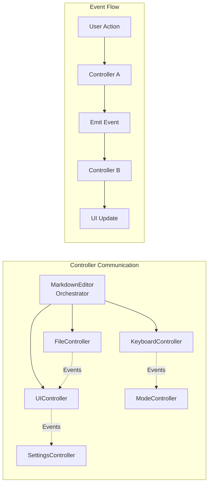
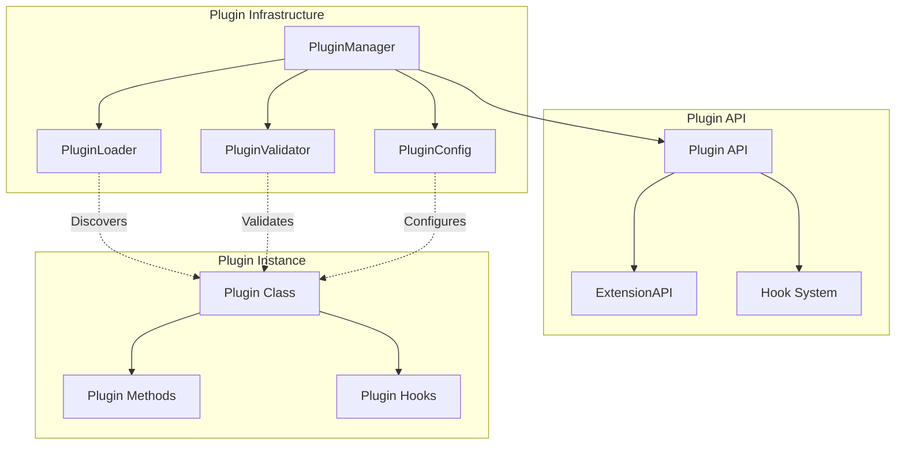
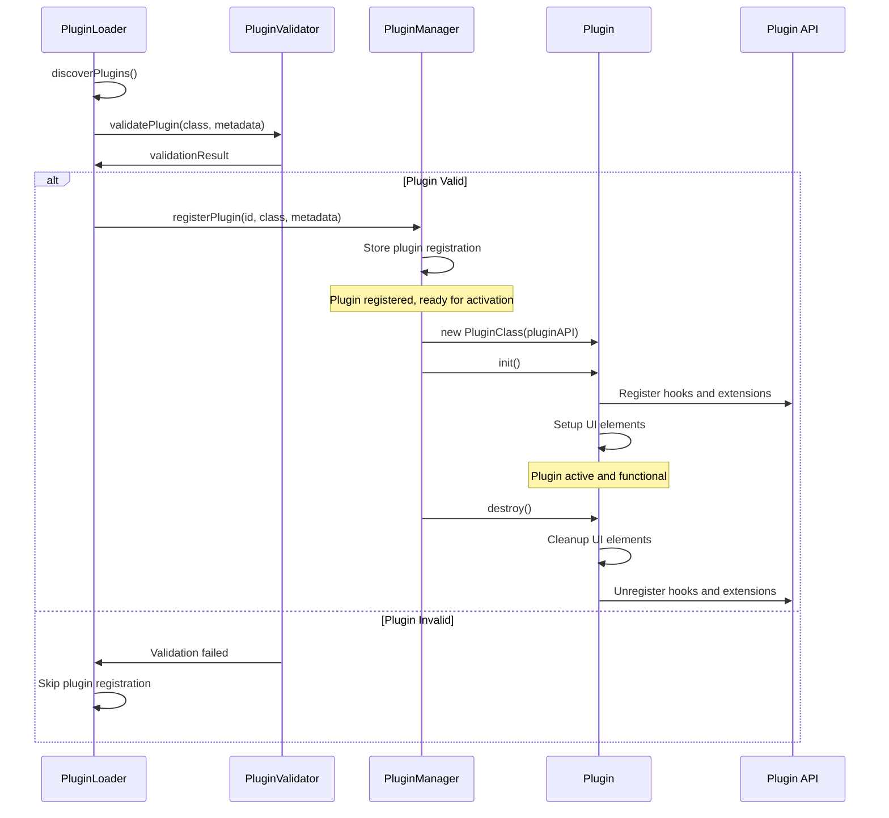
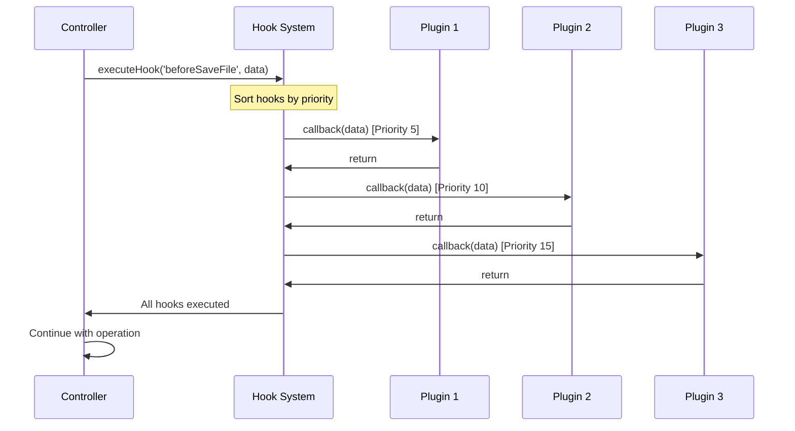
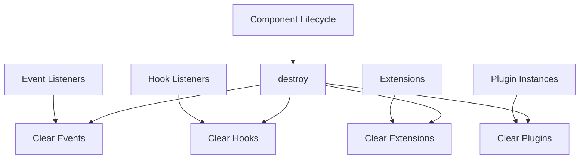

# Markdown Editor - Complete Technical Architecture Documentation

## Table of Contents

1. [Architecture Overview](#architecture-overview)
2. [Component System](#component-system)
3. [Controller Architecture](#controller-architecture)
4. [Plugin System](#plugin-system)
5. [Extension Points](#extension-points)
6. [Hook System](#hook-system)
7. [Building and Development](#building-and-development)
8. [Plugin Development Guide](#plugin-development-guide)
9. [API Reference](#api-reference)
10. [Performance Considerations](#performance-considerations)

---

## Architecture Overview

The Markdown Editor has been refactored from a monolithic structure into a modular, plugin-ready architecture. This transformation enables extensibility, maintainability, and scalability while preserving all original functionality.



### Key Architectural Principles

**Separation of Concerns**: Each controller handles a specific domain (files, UI, keyboard, etc.)

**Dependency Injection**: Controllers are injected into MarkdownEditor, enabling testing and customization

**Plugin Architecture**: Extensible system allowing third-party functionality without core modifications

**Hook System**: Event-driven architecture enabling plugins to react to application events

**Component Lifecycle**: Standardized initialization, update, and destruction patterns

---

## Component System

### BaseComponent Class

All controllers inherit from `BaseComponent`, providing standardized functionality:



### Component Lifecycle

Every component follows a standardized lifecycle:



---

## Controller Architecture

### Complete Controller Responsibilities

Each controller manages a specific aspect of the application:

**FileController** (`src/components/controllers/FileController.js` - 187 lines)
- File operations (new, open, save, close)
- Drag & drop handling
- File associations and startup files
- Recent files management

**UIController** (`src/components/controllers/UIController.js` - Completed)
- Theme management (light, dark, retro, contrast)
- Modal dialogs (settings, help, about)
- Distraction-free mode
- Layout controls

**KeyboardController** (`src/components/controllers/KeyboardController.js` - Completed)
- All application keyboard shortcuts
- Tab navigation shortcuts (Ctrl+Tab, Alt+1-9)
- Mode switching shortcuts (Ctrl+1,2,3)
- File operations (Ctrl+N,O,S)
- Find functionality (Ctrl+F)

**SettingsController** (`src/components/controllers/SettingsController.js` - Completed)
- Settings persistence (localStorage)
- Performance monitoring
- Configuration management
- Settings UI integration

**TabUIController** (`src/components/controllers/TabUIController.js` - Completed)
- Tab dropdown management (recent 9 tabs)
- Tab modal for all tabs with search
- Context menu operations (move, close, duplicate, pin)
- Pinned tabs functionality
- Tab keyboard navigation (Alt+1-9)

**ModeController** (`src/components/controllers/ModeController.js` - 198 lines)
- View mode switching (code/preview/split)
- Scroll position management
- Layout updates
- Monaco editor integration

**MarkdownActionController** (`src/components/controllers/MarkdownActionController.js` - 495 lines)
- Markdown formatting (bold, italic, headers)
- Text insertion and manipulation
- Task list interactions
- Multi-line operations

**ExportController** (`src/components/controllers/ExportController.js` - 154 lines)
- HTML export
- PDF printing
- Export dialogs
- Print optimization

### Controller Communication

Controllers communicate through the MarkdownEditor orchestrator and event system:



---

## Plugin System

### Plugin Architecture Overview

The plugin system enables third-party extensions without modifying core code:



### Plugin Lifecycle



### Plugin Structure

Every plugin must follow this structure:

```javascript
class MyPlugin {
  constructor(pluginAPI) {
    this.pluginAPI = pluginAPI;
    // Plugin initialization
  }

  async init() {
    // Plugin activation logic
    // Register hooks, add UI elements, etc.
  }

  async destroy() {
    // Plugin cleanup logic
    // Remove UI elements, unregister hooks, etc.
  }
}

// Required metadata
MyPlugin.metadata = {
  name: 'My Plugin',
  version: '1.0.0',
  description: 'Plugin description',
  author: 'Author Name'
};
```

### Actual Plugin API Interface

The Plugin API provides access to all 8 controllers and core functionality:

```javascript
const pluginAPI = {
  // Core components access
  getEditor: () => this.markdownEditor.editorComponent,
  getPreview: () => this.markdownEditor.previewComponent,
  getToolbar: () => this.markdownEditor.toolbarComponent,
  getTabManager: () => this.markdownEditor.tabManager,
  
  // Controllers access (all 8 controllers)
  getFileController: () => this.markdownEditor.fileController,
  getUIController: () => this.markdownEditor.uiController,
  getKeyboardController: () => this.markdownEditor.keyboardController,
  getSettingsController: () => this.markdownEditor.settingsController,
  getTabUIController: () => this.markdownEditor.tabUIController,
  getModeController: () => this.markdownEditor.modeController,
  getMarkdownActionController: () => this.markdownEditor.markdownActionController,
  getExportController: () => this.markdownEditor.exportController,
  
  // Extension registration
  registerExtension: (controller, extension) => {
    const controllerInstance = this.getControllerByName(controller);
    if (controllerInstance && controllerInstance.registerExtension) {
      return controllerInstance.registerExtension(extension);
    }
    return false;
  },
  
  // Hook registration
  addHook: (controller, hookName, callback, priority = 100) => {
    const controllerInstance = this.getControllerByName(controller);
    if (controllerInstance && controllerInstance.addHook) {
      controllerInstance.addHook(hookName, callback, priority);
      return true;
    }
    return false;
  }
};
```

### Controller Name Mapping

For plugin API usage, controllers are referenced by these specific names:

```javascript
// Controller name mapping in PluginManager.getControllerByName()
switch (controllerName) {
  case 'file': return this.markdownEditor.fileController;
  case 'ui': return this.markdownEditor.uiController;
  case 'keyboard': return this.markdownEditor.keyboardController;
  case 'settings': return this.markdownEditor.settingsController;
  case 'tabUI': return this.markdownEditor.tabUIController;
  case 'mode': return this.markdownEditor.modeController;
  case 'markdownAction': return this.markdownEditor.markdownActionController;
  case 'export': return this.markdownEditor.exportController;
  default: return null;
}
```

---

## Extension Points

### Controller Extension Points

Each controller provides specific extension points:

**FileController Extensions**
- Custom file formats
- Additional file operations
- File processing pipelines
- Import/export filters

**UIController Extensions**
- Custom themes
- Additional UI components
- Layout modifications
- Modal dialogs

**MarkdownActionController Extensions**
- Custom formatting actions
- Text processing functions
- Syntax extensions
- Editor enhancements

### Extension Registration

```javascript
// Register a file extension
pluginAPI.registerExtension('file', {
  name: 'customFileHandler',
  activate: () => {
    // Extension activation logic
  },
  deactivate: () => {
    // Extension cleanup logic
  },
  handleCustomFormat: (content) => {
    // Custom file format handling
  }
});
```

---

## Hook System

### Complete Hook List by Controller

**FileController Hooks**
- `beforeNewFile` - Before creating new file
- `afterNewFile` - After new file created
- `beforeOpenFile` - Before opening file
- `afterOpenFile` - After file opened
- `beforeSaveFile` - Before saving file
- `afterSaveFile` - After file saved
- `beforeCloseFile` - Before closing file
- `afterCloseFile` - After file closed

**UIController Hooks**
- `beforeThemeChange` - Before theme switch
- `afterThemeChange` - After theme switched
- `beforeModalShow` - Before modal display
- `afterModalShow` - After modal displayed
- `beforeModalHide` - Before modal hidden
- `afterModalHide` - After modal hidden

**KeyboardController Hooks**
- `beforeShortcut` - Before keyboard shortcut execution
- `afterShortcut` - After keyboard shortcut executed

**SettingsController Hooks**
- `beforeSettingsLoad` - Before settings loaded
- `afterSettingsLoad` - After settings loaded
- `beforeSettingsSave` - Before settings saved
- `afterSettingsSave` - After settings saved

**TabUIController Hooks**
- `beforeTabSwitch` - Before tab switch
- `afterTabSwitch` - After tab switched
- `beforeTabClose` - Before tab close
- `afterTabClose` - After tab closed

**ModeController Hooks**
- `beforeModeChange` - Before view mode change
- `afterModeChange` - After view mode changed

**MarkdownActionController Hooks**
- `beforeFormatText` - Before text formatting
- `afterFormatText` - After text formatted
- `beforeInsertText` - Before text insertion
- `afterInsertText` - After text inserted

**ExportController Hooks**
- `beforeExport` - Before export operation
- `afterExport` - After export completed

### Hook Registration and Usage

```javascript
// Register a hook with priority
pluginAPI.addHook('file', 'beforeSaveFile', (data) => {
  console.log('About to save file:', data.filename);
  // Modify data or perform actions
}, 10); // Priority 10 (lower = higher priority)

// Hook execution provides context data
pluginAPI.addHook('ui', 'afterThemeChange', (data) => {
  console.log('Theme changed to:', data.theme);
  // React to theme change
});
```

### Hook Execution Flow



---

## Building and Development

### Actual Project Structure

```
markdown-editor/
├── Markdown Viewer/
│   ├── src/
│   │   ├── components/
│   │   │   ├── controllers/          # Controller classes
│   │   │   │   ├── FileController.js           (✅ 187 lines)
│   │   │   │   ├── UIController.js             (✅ Completed)
│   │   │   │   ├── KeyboardController.js       (✅ Completed)
│   │   │   │   ├── SettingsController.js       (✅ Completed)
│   │   │   │   ├── TabUIController.js          (✅ Completed)
│   │   │   │   ├── ModeController.js           (✅ 198 lines)
│   │   │   │   ├── MarkdownActionController.js (✅ 495 lines)
│   │   │   │   └── ExportController.js         (✅ 154 lines)
│   │   │   ├── BaseComponent.js      # Base component class
│   │   │   └── MarkdownEditor.js     # Main orchestrator (~1000 lines reduced)
│   │   ├── core/                     # Core systems
│   │   │   ├── PluginManager.js      # Plugin management (187 lines)
│   │   │   ├── PluginLoader.js       # Plugin discovery (187 lines)
│   │   │   ├── PluginValidator.js    # Plugin validation (166 lines)
│   │   │   ├── PluginConfig.js       # Plugin configuration (93 lines)
│   │   │   ├── ExtensionAPI.js       # Extension system (90 lines)
│   │   │   └── ControllerRegistry.js # Controller registry
│   │   ├── plugins/                  # Plugin directory
│   │   │   └── SamplePlugin.js       # Example plugin (112 lines)
│   │   ├── styles.css                # Application styles (4000+ lines)
│   │   ├── main.js                   # Application entry
│   │   └── index.html                # Main HTML
│   └── src-tauri/                    # Tauri backend
├── REFACTORING_PLAN.md               # Refactoring documentation
├── CSS_REFACTORING_PLAN.md           # CSS refactoring plan
└── TECHNICAL_DOCUMENTATION_FINAL.md  # This document
```

### Current Build Process

**No Build System Required**
- All files loaded directly via script tags in index.html
- Plugin loading is manual (known plugins list in PluginLoader.js)
- No compilation or bundling needed
- Development changes visible on browser refresh

**Development Workflow**
1. Edit controller/plugin files directly
2. Refresh application to see changes
3. Use browser DevTools for debugging
4. Plugin validation happens at runtime

### Controller Development

```javascript
// Create new controller extending BaseComponent
class MyController extends BaseComponent {
  constructor(options = {}) {
    super('MyController', options);
    // Controller-specific initialization
  }

  async onInit() {
    // Controller initialization logic
    await this.executeHook('beforeInit');
    // Setup controller functionality
    await this.executeHook('afterInit');
  }

  async onUpdate(data) {
    // Controller update logic
  }

  onDestroy() {
    // Controller cleanup logic
  }
}
```

**Registering Controllers**

```javascript
// In MarkdownEditor initialization
const controllerRegistry = new ControllerRegistry();
controllerRegistry.register('myController', MyController);

// Create instance with dependency injection
const myController = controllerRegistry.createInstance('myController', {
  // Controller options
});
```

---

## Plugin Development Guide

### Creating a Basic Plugin

**Step 1: Plugin Class Structure**

```javascript
class MyAwesomePlugin {
  constructor(pluginAPI) {
    this.pluginAPI = pluginAPI;
    this.isActive = false;
    this.toolbarButton = null;
  }

  async init() {
    console.log('[MyAwesomePlugin] Initializing...');
    
    // Add UI elements
    this.addToolbarButton();
    
    // Register hooks
    this.registerHooks();
    
    // Register extensions
    this.registerExtensions();
    
    this.isActive = true;
    console.log('[MyAwesomePlugin] Initialized successfully');
  }

  addToolbarButton() {
    this.toolbarButton = document.createElement('button');
    this.toolbarButton.className = 'toolbar-btn my-plugin-btn';
    this.toolbarButton.innerHTML = '🚀 My Plugin';
    this.toolbarButton.title = 'My Awesome Plugin';
    
    this.toolbarButton.addEventListener('click', () => {
      this.handleButtonClick();
    });
    
    const toolbarRight = document.querySelector('.toolbar-right');
    if (toolbarRight) {
      toolbarRight.appendChild(this.toolbarButton);
    }
  }

  registerHooks() {
    // React to file operations
    this.pluginAPI.addHook('file', 'afterOpenFile', (data) => {
      console.log('[MyAwesomePlugin] File opened:', data.filename);
    });
    
    // React to theme changes
    this.pluginAPI.addHook('ui', 'afterThemeChange', (data) => {
      console.log('[MyAwesomePlugin] Theme changed to:', data.theme);
      this.updateTheme(data.theme);
    });
  }

  registerExtensions() {
    // Add custom markdown action
    this.pluginAPI.registerExtension('markdownAction', {
      name: 'myCustomAction',
      activate: () => {
        console.log('[MyAwesomePlugin] Extension activated');
      },
      customFormat: (text) => {
        return `**${text}**`; // Bold formatting
      }
    });
  }

  handleButtonClick() {
    const editor = this.pluginAPI.getEditor();
    if (editor && editor.isMonacoLoaded) {
      const position = editor.monacoEditor.getPosition();
      const insertText = '\n<!-- My Awesome Plugin was here! -->\n';
      
      editor.monacoEditor.executeEdits('my-awesome-plugin', [{
        range: new monaco.Range(position.lineNumber, position.column, position.lineNumber, position.column),
        text: insertText
      }]);
    }
  }

  updateTheme(theme) {
    // Update plugin UI based on theme
    if (this.toolbarButton) {
      this.toolbarButton.style.filter = theme === 'dark' ? 'invert(1)' : 'none';
    }
  }

  async destroy() {
    console.log('[MyAwesomePlugin] Destroying...');
    
    // Remove UI elements
    if (this.toolbarButton && this.toolbarButton.parentNode) {
      this.toolbarButton.parentNode.removeChild(this.toolbarButton);
      this.toolbarButton = null;
    }
    
    this.isActive = false;
    console.log('[MyAwesomePlugin] Destroyed successfully');
  }
}

// Required metadata
MyAwesomePlugin.metadata = {
  name: 'My Awesome Plugin',
  version: '1.0.0',
  description: 'An awesome plugin that demonstrates plugin capabilities',
  author: 'Your Name',
  dependencies: {
    // Optional: specify plugin dependencies
    // 'other-plugin': '1.0.0'
  }
};

// Make plugin available globally
window.MyAwesomePlugin = MyAwesomePlugin;
```

**Step 2: Plugin Registration**

Add your plugin to the plugin loader's known plugins list in `PluginLoader.js`:

```javascript
const knownPlugins = [
  'SamplePlugin.js',
  'MyAwesomePlugin.js'  // Add your plugin here
];
```

**Step 3: Plugin Configuration**

The plugin will automatically appear in the settings modal where users can enable/disable it.

### Advanced Plugin Features

**Custom Settings**

```javascript
class AdvancedPlugin {
  constructor(pluginAPI) {
    this.pluginAPI = pluginAPI;
    this.settings = {
      autoFormat: true,
      customPrefix: '[PLUGIN]'
    };
  }

  async init() {
    // Load plugin settings
    this.loadSettings();
    
    // Add settings UI
    this.addSettingsUI();
  }

  loadSettings() {
    // Use direct access to PluginConfig
    const config = new PluginConfig();
    
    this.settings.autoFormat = config.getPluginSetting('advanced-plugin', 'autoFormat', true);
    this.settings.customPrefix = config.getPluginSetting('advanced-plugin', 'customPrefix', '[PLUGIN]');
  }

  saveSettings() {
    // Use direct access to PluginConfig
    const config = new PluginConfig();
    
    config.setPluginSetting('advanced-plugin', 'autoFormat', this.settings.autoFormat);
    config.setPluginSetting('advanced-plugin', 'customPrefix', this.settings.customPrefix);
  }

  addSettingsUI() {
    // Add custom settings to the settings modal
    // This would require extending the settings system
  }
}
```

**File Format Extensions**

```javascript
class FileFormatPlugin {
  constructor(pluginAPI) {
    this.pluginAPI = pluginAPI;
  }

  async init() {
    // Register custom file format handler
    this.pluginAPI.registerExtension('file', {
      name: 'customFormatHandler',
      activate: () => {
        console.log('[FileFormatPlugin] Custom format handler activated');
      },
      canHandle: (filename) => {
        return filename.endsWith('.custom');
      },
      process: (content) => {
        // Convert custom format to markdown
        return this.convertCustomToMarkdown(content);
      }
    });
  }

  convertCustomToMarkdown(content) {
    // Custom format conversion logic
    return content.replace(/\[CUSTOM\]/g, '**Custom**');
  }
}
```

**Theme Extensions**

```javascript
class ThemePlugin {
  constructor(pluginAPI) {
    this.pluginAPI = pluginAPI;
  }

  async init() {
    // Register theme change hook
    this.pluginAPI.addHook('ui', 'afterThemeChange', (data) => {
      this.applyCustomThemeEnhancements(data.theme);
    });
    
    // Add custom theme
    this.addCustomTheme();
  }

  addCustomTheme() {
    // Inject custom CSS for new theme
    const style = document.createElement('style');
    style.textContent = `
      [data-theme="custom"] {
        --bg-primary: #f0f8ff;
        --text-primary: #2c3e50;
        /* Custom theme variables */
      }
    `;
    document.head.appendChild(style);
  }

  applyCustomThemeEnhancements(theme) {
    // Apply theme-specific enhancements
    if (theme === 'dark') {
      this.enableDarkModeFeatures();
    }
  }
}
```

### Plugin Security Guidelines

**Allowed Patterns**
- DOM manipulation with specific selectors
- Event listener registration
- CSS injection with style elements
- localStorage access for plugin settings
- Console logging for debugging

**Prohibited Patterns**
- `eval()` function usage
- `Function()` constructor
- `document.write()` calls
- Dynamic `innerHTML` with variables
- `localStorage.clear()` or `sessionStorage.clear()`
- Script tag injection

**Security Validation**

The PluginValidator automatically checks for these security issues:

```javascript
// Blocked patterns enforced by PluginValidator
const dangerousPatterns = [
  /eval\s*\(/,                                    // eval() calls
  /Function\s*\(/,                               // Function() constructor
  /document\.write/,                             // document.write
  /\.innerHTML\s*=\s*[a-zA-Z_$][a-zA-Z0-9_$]*/, // innerHTML with variables
  /\.outerHTML\s*=/,                            // outerHTML assignment
  /localStorage\.clear\s*\(/,                    // localStorage.clear()
  /sessionStorage\.clear\s*\(/                   // sessionStorage.clear()
];

// ✅ Safe patterns
element.innerHTML = '<span>Static content</span>';
localStorage.setItem('plugin-setting', value);
console.log('Plugin message');

// ❌ Dangerous patterns (will be blocked)
eval(userInput);
element.innerHTML = userVariable;
localStorage.clear();
```

**Plugin Size Limits:**
- Maximum plugin class size: 1MB
- Metadata validation for required fields: name, version, description
- Version format validation: x.y.z semantic versioning

---

## API Reference

### PluginAPI Interface

```typescript
interface PluginAPI {
  // Core Components
  getEditor(): EditorComponent;
  getPreview(): PreviewComponent;
  getToolbar(): ToolbarComponent;
  getTabManager(): TabManager;
  
  // Controllers (all 8 controllers)
  getFileController(): FileController;
  getUIController(): UIController;
  getKeyboardController(): KeyboardController;
  getSettingsController(): SettingsController;
  getTabUIController(): TabUIController;
  getModeController(): ModeController;
  getMarkdownActionController(): MarkdownActionController;
  getExportController(): ExportController;
  
  // Extension System
  registerExtension(controller: string, extension: Extension): boolean;
  
  // Hook System
  addHook(controller: string, hookName: string, callback: Function, priority?: number): boolean;
}
```

### BaseComponent Methods

```typescript
class BaseComponent {
  // Lifecycle
  init(): Promise<void>;
  update(data?: Object): Promise<void>;
  destroy(): void;
  
  // Events
  on(event: string, callback: Function): void;
  off(event: string, callback: Function): void;
  emit(event: string, data?: Object): void;
  
  // Hooks
  addHook(hookName: string, callback: Function, priority?: number): void;
  removeHook(hookName: string, callback: Function): void;
  executeHook(hookName: string, data?: Object): Promise<void>;
  
  // Extensions
  registerExtension(name: string, extension: Extension): void;
  unregisterExtension(name: string): boolean;
  getExtension(name: string): Extension;
  
  // Utilities
  getState(): ComponentState;
  getPerformanceMetrics(): PerformanceMetrics;
}
```

### Plugin Configuration API

```typescript
class PluginConfig {
  // Plugin enable/disable
  enablePlugin(pluginId: string): boolean;
  disablePlugin(pluginId: string): boolean;
  isPluginEnabled(pluginId: string): boolean;
  getEnabledPlugins(): string[];
  
  // Plugin-specific settings
  setPluginSetting(pluginId: string, key: string, value: any): void;
  getPluginSetting(pluginId: string, key: string, defaultValue?: any): any;
  getPluginSettings(pluginId: string): Object;
  resetPluginSettings(pluginId: string): void;
  
  // Configuration management
  resetAllConfig(): void;
}
```

### Plugin Metadata Schema

```typescript
interface PluginMetadata {
  name: string;                    // Display name
  version: string;                 // Semantic version (x.y.z)
  description: string;             // Plugin description
  author: string;                  // Author name
  dependencies?: {                 // Optional dependencies
    [pluginId: string]: string;    // Plugin ID: version
  };
  permissions?: string[];          // Optional permissions
  category?: string;               // Plugin category
  tags?: string[];                 // Search tags
}
```

### Hook Data Schemas

```typescript
// File hooks
interface FileHookData {
  filename?: string;
  content?: string;
  path?: string;
  type?: 'new' | 'open' | 'save' | 'close';
}

// UI hooks
interface UIHookData {
  theme?: string;
  modal?: string;
  layout?: string;
  component?: string;
}

// Markdown action hooks
interface MarkdownActionHookData {
  action?: string;
  text?: string;
  selection?: {
    start: number;
    end: number;
  };
  format?: string;
}
```

---

## Performance Considerations

### Component Performance

**Initialization Optimization**
- Lazy loading of heavy components
- Asynchronous initialization
- Performance metric tracking
- Memory usage monitoring

**Update Optimization**
- Debounced updates for frequent changes
- Selective component updates
- Virtual scrolling for large lists
- Efficient DOM manipulation

### Plugin Performance

**Plugin Loading**
- Lazy plugin activation
- Plugin size limits (1MB max)
- Validation caching
- Dependency resolution optimization

**Runtime Performance**
- Hook execution optimization
- Extension method caching
- Event listener management
- Memory leak prevention

### Memory Management



**Memory Leak Prevention**
- Automatic cleanup on component destruction
- Event listener removal
- Hook unregistration
- Extension cleanup
- Plugin instance disposal

### Performance Monitoring

The application includes built-in performance monitoring:

```javascript
// Get component performance metrics
const metrics = component.getPerformanceMetrics();
console.log('Init time:', metrics.initTime);
console.log('Average update time:', metrics.averageUpdateTime);
console.log('Update count:', metrics.updateCount);

// Monitor plugin performance using actual available methods
const activePlugins = pluginManager.getActivePlugins();
const allPlugins = pluginManager.getAllPlugins();
console.log('Active plugins:', activePlugins.length);
console.log('Total plugins:', allPlugins.length);

// Component state debugging
const state = component.getState();
// Returns: { name, isInitialized, childCount, eventListenerCount, 
//           hookCount, hooks, extensionCount, performanceMetrics }
```

### CSS Architecture Status

**Current State:**
- styles.css is 4000+ lines (monolithic)
- CSS_REFACTORING_PLAN.md exists for safe modular CSS architecture
- Plugin CSS integration is planned but not yet implemented
- CSS @import approach failed in Tauri environment
- Build-time concatenation approach planned for CSS modularity

---

## Conclusion

This technical documentation provides a comprehensive and accurate guide to the Markdown Editor's refactored architecture. The modular design enables:

- **Extensibility** through the plugin system with 8 specialized controllers
- **Maintainability** through separated concerns and standardized patterns
- **Testability** through dependency injection and component isolation
- **Performance** through optimized component lifecycle and memory management
- **Security** through comprehensive plugin validation and sandboxing

The architecture supports future enhancements while maintaining backward compatibility and ensuring robust performance across all supported platforms.

**Total Refactoring Achievement:**
- ~1000+ lines reduced from MarkdownEditor.js
- 8 specialized controllers extracted
- Complete plugin infrastructure implemented
- Hook system with 20+ extension points
- Security validation and configuration system
- Performance monitoring and memory management

For additional information, refer to the source code comments and the REFACTORING_PLAN.md document for detailed implementation history.