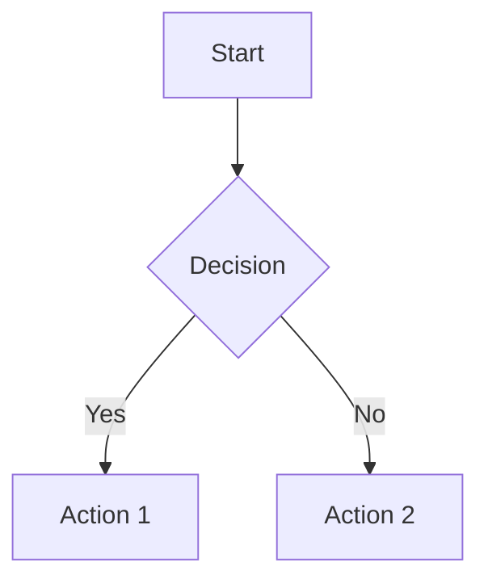

# Markdown Editor User Guide

A comprehensive guide to using the Markdown Editor - a powerful native desktop markdown viewer and editor.

## Table of Contents
- [Getting Started](#getting-started)
- [Interface Overview](#interface-overview)
- [View Modes](#view-modes)
- [Creating and Editing Documents](#creating-and-editing-documents)
- [File Operations](#file-operations)
- [Settings and Customization](#settings-and-customization)
- [Advanced Features](#advanced-features)
- [Keyboard Shortcuts](#keyboard-shortcuts)

---

## Getting Started

### First Launch
When you first open Markdown Editor, you'll see the **Welcome Screen** in Preview mode.

*[Image placeholder: Welcome screen showing the main interface]*

The welcome screen provides quick access to:
- **Create New File** - Start writing a new markdown document
- **Open Existing File** - Browse and open existing `.md` or `.markdown` files
- **Recent Files** - Quick access to recently opened documents
- **Help & Shortcuts** - View keyboard shortcuts and help
- **Settings** - Customize the application

### Opening Files
You can open markdown files in several ways:
1. **Double-click** any `.md` or `.markdown` file in Windows Explorer
2. Click **"Open Existing File"** on the welcome screen
3. Use **Ctrl+O** keyboard shortcut
4. **Drag and drop** files onto the application window

*[Image placeholder: File opening methods]*

---

## Interface Overview

The Markdown Editor interface consists of several key areas:

*[Image placeholder: Main interface with labeled sections]*

1. **Main Toolbar** - File operations, view modes, export options
2. **Markdown Toolbar** - Formatting tools (visible in Code mode)
3. **Editor/Preview Area** - Main content area
4. **Status Bar** - Cursor position, zoom controls, filename

---

## View Modes

Markdown Editor offers three distinct view modes to suit different workflows:

### Preview Mode (Default)
*[Image placeholder: Preview mode interface]*

- **Purpose**: Read and review rendered markdown content
- **Features**: 
  - Live rendering of markdown with GitHub-style formatting
  - Math expressions (KaTeX) and Mermaid diagrams
  - Interactive task lists
  - Zoom controls (50%-300%)
- **When to use**: Reading documents, reviewing final output, presentations

**To switch to Preview mode**: Click the **"Preview"** button or press **Ctrl+2**

### Code Mode
*[Image placeholder: Code mode interface]*

- **Purpose**: Write and edit markdown source code
- **Features**:
  - Monaco Editor with syntax highlighting
  - Markdown formatting toolbar
  - Font size controls
  - Undo/Redo buttons
  - Auto-completion for markdown syntax
- **When to use**: Writing new content, editing existing documents, detailed formatting

**To switch to Code mode**: Click the **"Code"** button or press **Ctrl+1**

### Split Mode
*[Image placeholder: Split mode interface]*

- **Purpose**: Edit and preview simultaneously
- **Features**:
  - Side-by-side editor and preview
  - Synchronized scrolling
  - Resizable panels (drag the splitter)
  - Real-time preview updates
- **When to use**: Writing while seeing live results, complex documents with formatting

**To switch to Split mode**: Click the **"Split"** button or press **Ctrl+3**

---

## Creating and Editing Documents

### Creating a New Document

1. **From Welcome Screen**: Click **"Create New File"**
2. **From Menu**: Click **"New"** button or press **Ctrl+N**
3. **Result**: Opens a new untitled document in Code mode with sample content

*[Image placeholder: New document creation process]*

### Writing Markdown

When in **Code mode**, you can write markdown using:

#### Markdown Toolbar
The formatting toolbar provides quick access to common markdown elements:

*[Image placeholder: Markdown toolbar with labeled buttons]*

- **Headers**: H1, H2, H3 buttons
- **Text Formatting**: Bold (B), Italic (I), Underline (U), Strikethrough (S)
- **Links and Media**: Link, Image, Code buttons
- **Lists**: Bullet lists, Numbered lists, Task lists
- **Structure**: Table, Horizontal rule, Blockquote
- **Font Controls**: Increase/decrease font size
- **Undo/Redo**: Quick access to undo/redo actions

#### Keyboard Shortcuts for Formatting
- **Ctrl+B**: Bold text
- **Ctrl+I**: Italic text
- **Ctrl+Shift+1/2/3**: Headers H1/H2/H3
- **Ctrl+Shift+M**: Toggle markdown toolbar

#### Live Preview
Switch to **Preview** or **Split** mode to see your markdown rendered in real-time with:
- GitHub-style formatting
- Syntax highlighting for code blocks
- Math expressions: `$inline$` and `$$display$$`
- Mermaid diagrams in code blocks
- Interactive task lists

*[Image placeholder: Live preview showing rendered markdown]*

---

## File Operations

### Saving Documents

#### Save (Ctrl+S)
- **New documents**: Opens "Save As" dialog to choose location and filename
- **Existing documents**: Saves changes to the current file
- **Visual indicator**: Asterisk (*) in title bar indicates unsaved changes

*[Image placeholder: Save dialog and unsaved changes indicator]*

#### Save As (Ctrl+Shift+S)
- Always opens dialog to save with a new name or location
- Access via dropdown arrow next to Save button

#### Auto-save Indicators
- **Clean state**: No asterisk in filename
- **Dirty state**: Asterisk (*) appears after filename when changes are made

### Opening Documents

#### File Browser (Ctrl+O)
1. Click **"Open"** button or press **Ctrl+O**
2. Navigate to your markdown file
3. Select and click **"Open"**
4. File loads in your default view mode

*[Image placeholder: File open dialog]*

#### Drag and Drop
- **Welcome screen**: Drop `.md` files to open them
- **Code mode**: Drop files to insert file paths as text
- **Visual feedback**: Blue highlight when dragging files over the application

#### Recent Files
The welcome screen shows your 3 most recently opened files for quick access.

*[Image placeholder: Recent files section]*

### Closing Documents

- **Close current file**: Click **"Close"** button or press **Ctrl+W**
- **Unsaved changes**: Prompts to save before closing
- **Result**: Returns to welcome screen

---

## Settings and Customization

### Accessing Settings
- Click **"Settings"** on welcome screen
- Press **Ctrl+,** (comma) from anywhere in the application
- Click gear icon in toolbar (if available)

*[Image placeholder: Settings dialog overview]*

### Appearance Settings

#### Theme Selection
- **Light Theme**: Clean, bright interface for daytime use
- **Dark Theme**: Easy on the eyes for low-light environments
- **Quick toggle**: Press **Ctrl+T** or click theme button in toolbar

*[Image placeholder: Light vs Dark theme comparison]*

#### Toolbar Sizes
Customize toolbar sizes for your preference:
- **Main Toolbar**: Small, Medium, Large
- **Markdown Toolbar**: Small, Medium, Large

### Editor Settings

#### Default Mode
Set which mode the application opens in:
- **Code**: Always start in editing mode
- **Preview**: Always start in reading mode (default)
- **Split**: Always start with both editor and preview

#### Text Suggestions
- **Enabled**: Monaco editor provides auto-completion and suggestions
- **Disabled**: Clean editing experience without suggestions

#### Markdown Toolbar
- **Enabled**: Show formatting toolbar in Code mode (default)
- **Disabled**: Hide toolbar for minimal interface

### Interface Settings

#### Centered Layout
- **Enabled**: Content centered with page-like margins
- **Disabled**: Full-width content area

#### Page Size (when centered layout is enabled)
- **A4**: Standard document size
- **Letter**: US standard size
- **A3**: Larger document size

### Performance Information
The settings dialog shows real-time performance metrics:
- Startup time
- Memory usage
- File operation speeds
- Library loading status

*[Image placeholder: Performance metrics section]*

---

## Advanced Features

### Math Expressions
Markdown Editor supports KaTeX for mathematical notation:

#### Inline Math
Use single dollar signs: `$E = mc^2$` renders as: $E = mc^2$

#### Display Math
Use double dollar signs for centered equations:
```
$$\int_{-\infty}^{\infty} e^{-x^2} dx = \sqrt{\pi}$$
```

*[Image placeholder: Math expressions in preview]*

### Mermaid Diagrams
Create flowcharts, sequence diagrams, and more:

````markdown

````

*[Image placeholder: Mermaid diagram in preview]*

### Interactive Task Lists
Create clickable task lists that persist their state:

```markdown
- [x] Completed task
- [ ] Pending task
- [ ] Another pending task
```

Click checkboxes in Preview mode to toggle completion status.

*[Image placeholder: Interactive task lists]*

### Footnotes
Add footnotes to your documents with automatic numbering and linking:

#### Creating Footnotes
Use `[^id]` for footnote references and `[^id]: definition` for definitions:

```markdown
This text has a footnote[^1] and another one[^note].

[^1]: This is the first footnote definition.
[^note]: This is a named footnote instead of numbered.
```

#### Features
- **Clickable References**: Footnote markers become clickable superscript links
- **Auto-Generated Section**: Footnotes appear at the bottom with back-references
- **Multiple References**: Same footnote can be referenced multiple times
- **Named Footnotes**: Use descriptive names like `[^note]` instead of numbers

*[Image placeholder: Footnotes in preview with clickable links]*

### Export Options

#### HTML Export (Ctrl+Shift+E)
- Exports current document as standalone HTML file
- Includes all styling and formatting
- Preserves math expressions and diagrams

#### PDF Export/Print (Ctrl+P)
- Opens browser print dialog
- Choose "Save as PDF" for PDF export
- Optimized print styles included

*[Image placeholder: Export options and print dialog]*

### Zoom Controls
In Preview mode, use zoom controls for better readability:
- **Zoom In**: Ctrl+= or click 🔍+ button
- **Zoom Out**: Ctrl+- or click 🔍- button
- **Reset Zoom**: Ctrl+0 or click "Reset" button
- **Range**: 50% to 300%

*[Image placeholder: Zoom controls in action]*

---

## Keyboard Shortcuts

### File Operations
| Shortcut | Action |
|----------|--------|
| `Ctrl+N` | New file |
| `Ctrl+O` | Open file |
| `Ctrl+S` | Save file |
| `Ctrl+Shift+S` | Save as |
| `Ctrl+W` | Close file |
| `Ctrl+Q` | Quit application |

### View Modes
| Shortcut | Action |
|----------|--------|
| `Ctrl+1` | Code mode |
| `Ctrl+2` | Preview mode |
| `Ctrl+3` | Split mode |
| `F11` | Fullscreen |
| `Shift+F11` | Distraction-free mode |
| `Esc` | Exit distraction-free |

### Text Formatting
| Shortcut | Action |
|----------|--------|
| `Ctrl+B` | Bold text |
| `Ctrl+I` | Italic text |
| `Ctrl+Shift+1` | Header 1 |
| `Ctrl+Shift+2` | Header 2 |
| `Ctrl+Shift+3` | Header 3 |

### Application
| Shortcut | Action |
|----------|--------|
| `Ctrl+T` | Toggle theme |
| `Ctrl+,` | Settings |
| `Ctrl+Shift+M` | Toggle markdown toolbar |
| `F1` | Help |
| `F5` | Refresh preview |

### Preview Mode
| Shortcut | Action |
|----------|--------|
| `Ctrl+=` | Zoom in |
| `Ctrl+-` | Zoom out |
| `Ctrl+0` | Reset zoom |

### Export & Print
| Shortcut | Action |
|----------|--------|
| `Ctrl+Shift+E` | Export to HTML |
| `Ctrl+P` | Print/Export PDF |

---

## Tips and Best Practices

### Workflow Recommendations

1. **Start in Preview mode** to review existing documents
2. **Switch to Code mode** when you need to edit or create content
3. **Use Split mode** for complex documents where you need to see formatting results immediately
4. **Save frequently** (Ctrl+S) to avoid losing work
5. **Use the markdown toolbar** for quick formatting instead of typing markdown syntax

### Performance Tips

- **Large documents**: Use Code mode for better performance when editing very large files
- **Multiple files**: Close unused documents to free up memory
- **Zoom**: Reset zoom to 100% for optimal performance in Preview mode

### File Organization

- **Use descriptive filenames** with `.md` extension
- **Organize in folders** by project or topic
- **Recent files** feature helps quickly access frequently used documents

---

## Troubleshooting

### Common Issues

**File won't open when double-clicked**
- Ensure the file has `.md` or `.markdown` extension
- Try right-click → "Open with" → Markdown Editor

**Preview not updating**
- Press F5 to refresh preview
- Check if you're in the correct view mode

**Formatting toolbar missing**
- Switch to Code mode (Ctrl+1)
- Enable toolbar in Settings if disabled

**Math expressions not rendering**
- Check internet connection (KaTeX loads from CDN)
- Verify correct syntax: `$inline$` or `$$display$$`

### Getting Help

- Press **F1** for built-in help and shortcuts
- Check the **About** dialog for version information
- Visit the project repository for documentation and issues

---

*This guide covers the essential features of Markdown Editor. For advanced usage and latest updates, refer to the application's built-in help system and project documentation.*