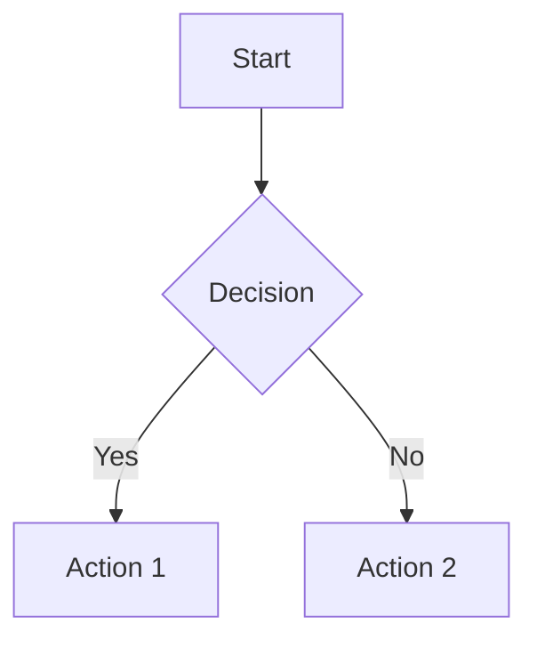
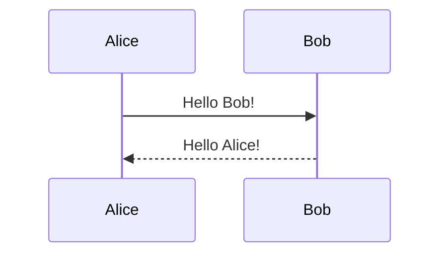

# Markdown Editor - Complete User Manual

*Version 1.0 - A comprehensive guide to mastering your markdown editing experience*

---

## Table of Contents

1. [Getting Started](#getting-started)
2. [Interface Overview](#interface-overview)
3. [Core Features](#core-features)
4. [Advanced Functionality](#advanced-functionality)
5. [Customization Options](#customization-options)
6. [Technical Capabilities and Limitations](#technical-capabilities-and-limitations)
7. [Troubleshooting](#troubleshooting)
8. [Appendix](#appendix)

---

## Getting Started

Welcome to the Markdown Editor, a powerful application designed to provide you with a professional markdown editing experience. This manual will guide you through every aspect of the application, from basic operations to advanced features that will enhance your productivity.

**[Screenshot Placeholder: Welcome Screen]**

When you first launch the application, you'll be greeted with a clean, intuitive interface that immediately invites you to start working with your markdown files. The application is designed with performance in mind, featuring lightning-fast startup times of less than 60 milliseconds and seamless file operations.

### Initial Setup

The application requires no complex configuration to get started. Simply launch the executable file, and you're ready to begin editing. The interface automatically adapts to your system's theme preferences, though you can customize this behavior through the settings panel.

**[Screenshot Placeholder: First Launch Interface]**

---

## Interface Overview

The Markdown Editor features a thoughtfully designed interface that balances functionality with simplicity. Understanding the layout will help you navigate efficiently and take full advantage of all available features.

### Main Window Layout

The main window is divided into several key areas, each serving a specific purpose in your editing workflow. The top section houses the toolbar with all essential editing tools, while the central area contains your editing and preview panes. The interface adapts dynamically based on your chosen viewing mode.

**[Screenshot Placeholder: Main Interface Overview with Labels]**

### Toolbar Components

The toolbar serves as your command center, providing quick access to the most frequently used functions. The toolbar is fully customizable, allowing you to choose between small, medium, and large sizing options to match your preferences and screen resolution.

**[Screenshot Placeholder: Toolbar Detail View]**

The toolbar includes file operations, editing tools, view mode controls, and formatting options. Each button is designed with clear iconography and provides helpful tooltips when you hover over them, ensuring you always know what each function does.

### Tab Management System

One of the most powerful features of the Markdown Editor is its sophisticated tab management system. Unlike simple tab implementations, this system is designed to handle dozens or even hundreds of open files without performance degradation.

**[Screenshot Placeholder: Multiple Tabs Open]**

The tab system employs intelligent virtualization technology, meaning that only visible tabs consume active memory resources. This allows you to keep many files open simultaneously without impacting system performance. Each tab displays the filename and indicates whether the file has unsaved changes through visual cues.

---

## Core Features

### Multi-Mode Editing Experience

The Markdown Editor offers three distinct viewing modes, each optimized for different aspects of your workflow. Understanding when and how to use each mode will significantly enhance your productivity.

#### Code Mode

Code mode provides you with a pure editing experience, featuring the powerful Monaco Editor engine that powers Visual Studio Code. In this mode, you have access to advanced text editing features including syntax highlighting, intelligent indentation, and comprehensive find-and-replace functionality.

**[Screenshot Placeholder: Code Mode Interface]**

The Monaco Editor integration means you get professional-grade editing capabilities including multi-cursor editing, block selection, and advanced search patterns. The editor remembers your cursor position and scroll location, so when you switch between files or modes, you return exactly where you left off.

#### Preview Mode

Preview mode transforms your markdown into beautifully rendered HTML, showing you exactly how your content will appear to readers. The preview uses GitHub-flavored markdown rendering, ensuring compatibility with the most widely used markdown standard.

**[Screenshot Placeholder: Preview Mode Interface]**

The preview automatically updates as you make changes in code mode, providing real-time feedback on your formatting. The rendering engine supports advanced features including mathematical expressions through KaTeX and interactive diagrams through Mermaid.js.

#### Split Mode

Split mode combines the best of both worlds, displaying your raw markdown code alongside the rendered preview. This mode is particularly useful when you're learning markdown syntax or when you need to see immediate visual feedback while editing.

**[Screenshot Placeholder: Split Mode Interface]**

The split view maintains synchronized scrolling between the code and preview panes, so you can always see how your current editing position translates to the final output. You can adjust the split ratio by dragging the divider between the panes.

### File Operations

The application provides comprehensive file management capabilities that integrate seamlessly with your operating system. You can open files through traditional file dialogs, drag-and-drop operations, or by associating the application with markdown file types.

**[Screenshot Placeholder: File Operations Menu]**

When you drag markdown files onto the application window, they automatically open in new tabs. The application maintains file associations, so double-clicking markdown files in your file explorer will open them directly in the Markdown Editor.

### Advanced Text Editing

The text editing capabilities extend far beyond basic typing. The integrated Monaco Editor provides sophisticated features that rival dedicated code editors, making complex document editing tasks much more manageable.

**[Screenshot Placeholder: Find and Replace Dialog]**

The find-and-replace functionality supports regular expressions, case-sensitive matching, and whole-word searches. The search interface appears as a non-intrusive overlay that doesn't disrupt your document layout, allowing you to maintain context while searching.

---

## Advanced Functionality

### Mathematical Expression Support

The Markdown Editor includes full support for mathematical expressions through KaTeX integration. This allows you to include complex mathematical notation directly in your markdown documents, with rendering that matches publication-quality standards.

**[Screenshot Placeholder: Mathematical Expressions Rendered]**

Mathematical expressions can be included either inline with your text or as standalone display equations. The rendering is performed in real-time, so you can see your equations take shape as you type them.

### Diagram Creation

Through Mermaid.js integration, you can create sophisticated diagrams using simple text-based syntax. This feature supports flowcharts, sequence diagrams, Gantt charts, and many other diagram types that are essential for technical documentation.

**[Screenshot Placeholder: Mermaid Diagram Examples]**

The diagram rendering happens automatically when you include properly formatted Mermaid code blocks in your markdown. The diagrams are fully interactive in preview mode and maintain their quality when exported.

### Interactive Task Lists

Task lists in the Markdown Editor go beyond simple checkboxes. They're fully interactive, allowing you to check and uncheck items directly in the preview mode. The application remembers the state of your task lists, making it an effective tool for project management and note-taking.

**[Screenshot Placeholder: Interactive Task Lists]**

When you check or uncheck items in preview mode, the changes are automatically reflected in your source markdown, maintaining synchronization between your raw text and the visual representation.

### Export and Sharing

The application provides multiple options for sharing your work with others. You can export your documents as HTML files that maintain all formatting and interactive elements, or print them as PDF documents for physical distribution.

**[Screenshot Placeholder: Export Options Dialog]**

The HTML export includes all necessary CSS and JavaScript to ensure your documents display correctly in any modern web browser, complete with syntax highlighting for code blocks and properly rendered mathematical expressions.

---

## Customization Options

### Theme Selection

The Markdown Editor offers three carefully crafted themes that provide optimal viewing experiences under different conditions. Each theme is designed to reduce eye strain while maintaining excellent readability and visual appeal.

**[Screenshot Placeholder: Theme Selection Interface]**

The Light theme provides a clean, bright interface perfect for daytime work. The Dark theme offers a modern, low-contrast experience ideal for extended editing sessions or low-light environments. The Retro theme combines vintage aesthetics with modern functionality for users who prefer a classic computing feel.

### Font and Display Settings

You have complete control over the visual presentation of your text. Font size adjustments range from 10 pixels to 24 pixels, allowing you to find the perfect balance between readability and screen real estate utilization.

**[Screenshot Placeholder: Font Size Controls]**

The preview zoom functionality operates independently of the editor font size, giving you the flexibility to edit at one magnification level while viewing the rendered output at another. Zoom levels range from 50% to 300%, accommodating various screen sizes and visual preferences.

### Toolbar Customization

The toolbar can be configured to match your workflow preferences and screen constraints. Three size options ensure that the interface works well on everything from compact laptops to large desktop displays.

**[Screenshot Placeholder: Toolbar Size Options]**

Small toolbar mode maximizes your editing space, medium provides a balanced approach, and large mode offers enhanced accessibility with bigger touch targets and more prominent visual elements.

### Performance Optimization

The application includes sophisticated performance monitoring and optimization features that ensure smooth operation regardless of your document size or system specifications.

**[Screenshot Placeholder: Performance Dashboard]**

The performance dashboard provides real-time insights into memory usage, rendering performance, and system resource utilization. This information helps you understand how the application is performing and can guide decisions about optimal usage patterns.

---

## Technical Capabilities and Limitations

### Markdown Rendering Engine

The Markdown Editor uses a carefully tuned rendering pipeline that balances speed with feature completeness. The engine supports GitHub-flavored markdown with extensions for mathematical expressions and diagrams.

#### Supported Markdown Features

The application handles all standard markdown syntax including headers, emphasis, links, images, code blocks, tables, and lists. Extended features include strikethrough text, task lists, and automatic URL linking.

#### Markdown Limitations

While the rendering engine is comprehensive, there are some limitations to be aware of. Custom HTML embedding is restricted for security reasons, and some advanced GitHub-specific features like mention linking are not supported in the standalone application.

### KaTeX Mathematical Expressions

KaTeX provides fast, high-quality mathematical typesetting that rivals traditional LaTeX output. The integration supports both inline and display mathematics with a comprehensive symbol library.

#### KaTeX Capabilities

You can create complex mathematical expressions including fractions, matrices, integrals, summations, and specialized notation for various mathematical fields. The rendering is performed client-side, ensuring fast display updates.

**Example of supported KaTeX syntax:**
```latex
$$\int_{-\infty}^{\infty} e^{-x^2} dx = \sqrt{\pi}$$

Inline math: $E = mc^2$

Matrix notation: $\begin{pmatrix} a & b \\ c & d \end{pmatrix}$
```

#### KaTeX Limitations

KaTeX focuses on mathematical typesetting and doesn't support some LaTeX features like custom macros, complex document structuring commands, or non-mathematical text formatting. The symbol library, while extensive, doesn't include every possible mathematical symbol.

### Mermaid.js Diagram Support

Mermaid.js enables the creation of diagrams and flowcharts using simple text syntax. The integration supports real-time rendering and interactive elements.

#### Supported Diagram Types

The application supports flowcharts, sequence diagrams, class diagrams, state diagrams, Gantt charts, pie charts, and Git graphs. Each diagram type has its own syntax optimized for clarity and ease of use.

**Example Mermaid diagrams:**





#### Mermaid Limitations

Complex diagrams with many elements may experience performance issues in real-time rendering. Some advanced styling options available in standalone Mermaid are not supported. Very large diagrams may not export properly to certain formats.

### Copy and Wrap Functionality

The application includes intelligent text manipulation features that help with common editing tasks. The copy and wrap functions provide quick ways to format and restructure your content.

**[Screenshot Placeholder: Copy/Wrap Buttons Interface]**

These features understand markdown syntax and can intelligently handle operations like wrapping text in formatting markers or copying formatted content while preserving structure.

### Performance Characteristics

The application is optimized for handling large documents and multiple open files simultaneously. Memory usage is carefully managed through virtualization techniques and intelligent caching.

#### Performance Strengths

Startup time is consistently under 60 milliseconds, file operations complete in under 500 milliseconds, and tab switching happens in under 35 milliseconds. The application can handle documents with thousands of lines without performance degradation.

#### Performance Limitations

Very large images embedded in markdown may slow preview rendering. Documents with hundreds of complex Mermaid diagrams may experience slower switching between modes. Memory usage scales with the number of open tabs, though virtualization minimizes this impact.

---

## Troubleshooting

### Common Issues and Solutions

Most issues you might encounter have straightforward solutions. Understanding these common scenarios will help you resolve problems quickly and maintain your productivity.

#### File Opening Problems

If files don't open correctly, verify that they have proper markdown file extensions (.md, .markdown, .mdown). The application may not recognize files with unusual extensions or encoding issues.

#### Rendering Issues

If mathematical expressions or diagrams don't render properly, check that your syntax matches the supported formats. Invalid syntax in KaTeX or Mermaid blocks will prevent rendering of those specific elements.

#### Performance Issues

If the application becomes slow, consider closing unused tabs or restarting the application to clear cached data. Very large files or complex diagrams may require more system resources.

### Getting Help

The application includes built-in help resources and error reporting features. Most issues can be resolved through the troubleshooting guides, but complex problems may require additional support.

---

## Appendix

### Keyboard Shortcuts Reference

The Markdown Editor supports a comprehensive set of keyboard shortcuts designed to accelerate your workflow and reduce reliance on mouse operations.

#### File Operations
- `Ctrl+O` (Windows/Linux) / `Cmd+O` (macOS): Open file
- `Ctrl+S` (Windows/Linux) / `Cmd+S` (macOS): Save file
- `Ctrl+Shift+S` (Windows/Linux) / `Cmd+Shift+S` (macOS): Save as

#### Editing Operations
- `Ctrl+F` (Windows/Linux) / `Cmd+F` (macOS): Find
- `Ctrl+H` (Windows/Linux) / `Cmd+H` (macOS): Find and replace
- `Ctrl+Z` (Windows/Linux) / `Cmd+Z` (macOS): Undo
- `Ctrl+Y` (Windows/Linux) / `Cmd+Y` (macOS): Redo

#### View Controls
- `Ctrl+=` (Windows/Linux) / `Cmd+=` (macOS): Zoom in
- `Ctrl+-` (Windows/Linux) / `Cmd+-` (macOS): Zoom out
- `Ctrl+0` (Windows/Linux) / `Cmd+0` (macOS): Reset zoom

#### Tab Navigation
- `Alt+1-9`: Switch to numbered tab
- `Ctrl+Tab`: Navigate between tabs
- `Ctrl+Shift+Tab`: View all tabs

### File Format Support

The application primarily works with markdown files but supports various related formats and extensions.

#### Supported Extensions
- `.md` - Standard markdown
- `.markdown` - Alternative markdown extension
- `.mdown` - Markdown variant
- `.mkd` - Markdown variant
- `.text` - Plain text files

#### Export Formats
- HTML with embedded CSS and JavaScript
- PDF through system print functionality
- Plain text markdown

### System Requirements Detail

Understanding the system requirements ensures optimal performance and compatibility across different computing environments.

#### Minimum Requirements
- **Operating System**: Windows 10 (1903+), macOS 10.13+, or Linux equivalent
- **Memory**: 4GB RAM
- **Storage**: 100MB free space
- **Display**: 1024x768 resolution

#### Recommended Specifications
- **Memory**: 8GB RAM for optimal performance with large files
- **Storage**: SSD for faster file operations
- **Display**: 1920x1080 or higher for best interface experience

### Technical Architecture

The Markdown Editor is built using modern web technologies wrapped in a native application framework, providing the best of both worlds: web technology flexibility with native performance.

#### Core Technologies
- **Frontend**: HTML5, CSS3, JavaScript with Monaco Editor
- **Backend**: Rust with Tauri framework
- **Rendering**: Marked.js for markdown, KaTeX for math, Mermaid.js for diagrams
- **Editor**: Monaco Editor (Visual Studio Code engine)

#### Security Features
- Sandboxed file access prevents unauthorized system access
- Content Security Policy (CSP) protection against malicious content
- No network access required for core functionality

### Version History and Updates

The application follows semantic versioning and provides regular updates with new features, performance improvements, and bug fixes.

#### Update Mechanism
Updates are delivered through the standard application distribution channels for each platform. The application checks for updates periodically and notifies users when new versions are available.

#### Backward Compatibility
Document formats remain compatible across versions, ensuring that files created in older versions continue to work in newer releases.

---

*This manual represents the complete feature set of the Markdown Editor. For additional support or feature requests, please refer to the project documentation or contact the development team.*

**Document Version**: 1.0  
**Last Updated**: [Date Placeholder]  
**Application Version**: [Version Placeholder]