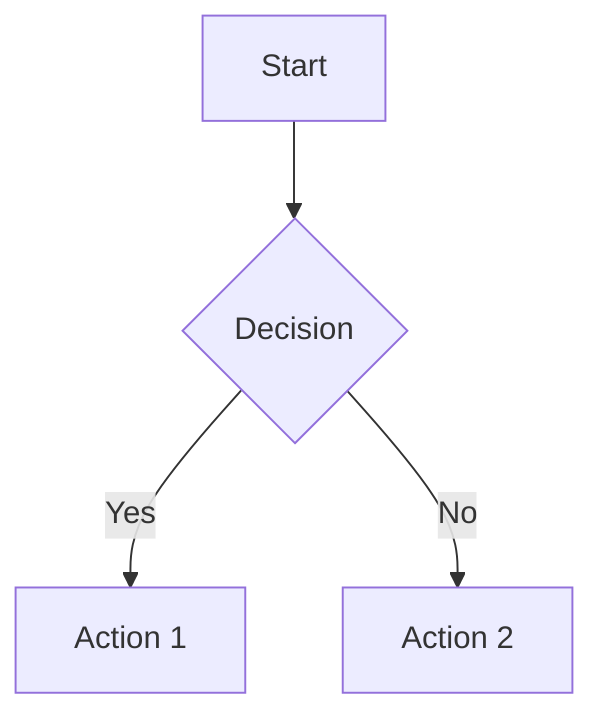
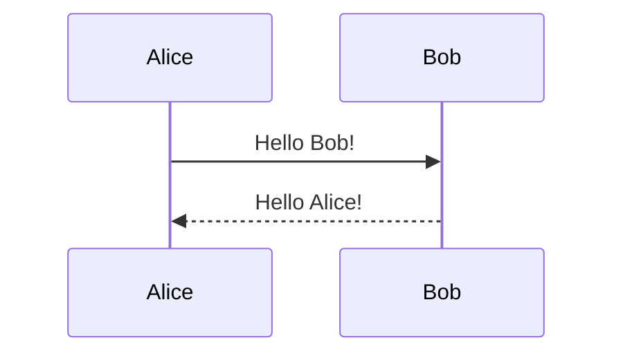

# Markdown Editor - Complete User Manual

*Version 2.0 - A comprehensive guide to mastering your markdown editing experience*

---

## Table of Contents

1. [Getting Started](#getting-started)
2. [Interface Overview](#interface-overview)
3. [Core Features](#core-features)
4. [Advanced Functionality](#advanced-functionality)
5. [Tab Management System](#tab-management-system)
6. [Context Menus](#context-menus)
7. [Plugin System](#plugin-system)
8. [Performance & Monitoring](#performance--monitoring)
9. [Customization Options](#customization-options)
10. [Technical Capabilities and Limitations](#technical-capabilities-and-limitations)
11. [Troubleshooting](#troubleshooting)
12. [Appendix](#appendix)

---

## Getting Started

Welcome to the Markdown Editor, a powerful application designed to provide you with a professional markdown editing experience. This manual covers all features including the new context menu system, plugin architecture, and performance monitoring dashboard.

### Initial Setup

The application requires no complex configuration to get started. Simply launch the executable file, and you're ready to begin editing. The interface automatically adapts to your system's theme preferences.

**New in Version 2.0:**
- Enhanced startup performance (<60ms)
- Plugin system (disabled by default)
- Context menu integration
- Performance monitoring dashboard

---

## Interface Overview

### Main Window Layout

The main window features a sophisticated multi-pane layout with intelligent tab management, context-sensitive menus, and real-time performance monitoring.

### Toolbar Components

The toolbar includes:
- **File Operations**: New, Open, Save, Save As with dropdown options
- **Mode Controls**: Code, Preview, Split mode buttons
- **Editing Tools**: Undo, Redo, Find & Replace
- **View Controls**: Theme toggle, Distraction-free mode, Settings
- **Export Options**: HTML export, PDF printing

### Enhanced Tab System

The tab system now supports:
- **Smart Dropdown**: Shows 9 most recent tabs with numbers
- **Tab Modal**: Search and navigate all open tabs (Ctrl+Shift+Tab)
- **Context Menus**: Right-click for advanced tab operations
- **Performance Virtualization**: Handles 50+ tabs efficiently

---

## Core Features

### Multi-Mode Editing Experience

#### Code Mode
- **Monaco Editor Integration**: Professional-grade editing with VS Code engine
- **Syntax Highlighting**: Full markdown syntax support
- **Advanced Search**: Regex support, case-sensitive matching
- **Multi-cursor Editing**: Block selection and simultaneous editing
- **Scroll Position Memory**: Remembers cursor and scroll positions

#### Preview Mode
- **GitHub-Flavored Markdown**: Standard-compliant rendering
- **Real-time Updates**: Live preview as you type
- **Interactive Elements**: Clickable task lists, working links
- **Context Menu**: Right-click for reload, sync, export options
- **Zoom Controls**: 50%-300% zoom with keyboard shortcuts

#### Split Mode
- **Synchronized Views**: Code and preview side-by-side
- **Independent Scrolling**: Each pane scrolls independently
- **Adjustable Split**: Drag divider to resize panes
- **Unified Operations**: Actions affect both panes appropriately

### File Operations

#### Opening Files
- **Traditional Dialog**: Ctrl+O opens file picker
- **Drag & Drop**: Drop files directly onto window
- **File Associations**: Double-click .md files in explorer
- **Multiple Files**: Each file opens in new tab

#### Saving Files
- **Quick Save**: Ctrl+S saves current file
- **Save As**: Ctrl+Shift+S with location picker
- **Auto-save Indicators**: Visual cues for unsaved changes
- **Dropdown Options**: Save with encoding options

---

## Advanced Functionality

### Mathematical Expression Support

Full KaTeX integration for publication-quality mathematical notation:

```latex
$$\int_{-\infty}^{\infty} e^{-x^2} dx = \sqrt{\pi}$$

Inline math: $E = mc^2$

Matrix notation: $\begin{pmatrix} a & b \\ c & d \end{pmatrix}$
```

### Diagram Creation

Mermaid.js integration supports multiple diagram types:





### Interactive Task Lists

Task lists are fully interactive in Preview mode:

```markdown
- [x] Completed task
- [ ] Pending task
- [ ] Another pending task
  - [x] Nested completed task
  - [ ] Nested pending task
```

Click checkboxes in Preview mode to toggle states. Changes automatically sync to source markdown.

### Export and Sharing

#### HTML Export
- **Complete Packages**: Includes CSS, JavaScript, and assets
- **Standalone Files**: Self-contained HTML documents
- **Syntax Highlighting**: Preserved in exported files
- **Mathematical Expressions**: Fully rendered in output

#### PDF Export
- **Print Integration**: Uses system print dialog
- **Layout Preservation**: Maintains formatting and structure
- **Cross-platform**: Works on Windows, macOS, and Linux

---

## Tab Management System

### Smart Tab Organization

#### Tab Dropdown
- **Recent 9 Tabs**: Shows most recently accessed files
- **Numbered Access**: Alt+1-9 for quick switching
- **Visual Indicators**: Shows dirty state, active tab
- **Overflow Handling**: "More" button for additional tabs

#### Tab Modal (Ctrl+Shift+Tab)
- **Search Functionality**: Filter tabs by filename
- **Keyboard Navigation**: Arrow keys and Enter to select
- **Batch Operations**: Close multiple tabs
- **Performance Info**: Shows tab count and memory usage

### Tab Operations

#### Context Menu (Right-click)
- **Close Tab**: Close current tab
- **Close Others**: Close all except current
- **Close All**: Close all tabs
- **Duplicate Tab**: Create copy of current tab
- **Reveal in Explorer**: Show file in system file manager
- **Move to Position**: Move tab to specific position (1-9)

#### Advanced Features
- **Tab Persistence**: Restores all tabs on app restart
- **Scroll Position Memory**: Remembers position per tab per mode
- **Dirty State Tracking**: Visual indicators for unsaved changes
- **Performance Virtualization**: Optimizes memory for 15+ tabs

---

## Context Menus

### Preview Mode Context Menu

Right-click in Preview mode for:

#### File Operations
- **Reload File**: Refresh file from disk
- **Sync from Code**: Update preview with current editor content

#### Export Options
- **Export to HTML**: Save as standalone HTML file
- **Export to PDF**: Print/save as PDF document

#### System Operations
- **Restart Application**: Clean restart with tab restoration

### Tab Context Menu

Right-click on tabs for:

#### Tab Management
- **Close Tab**: Close selected tab
- **Close Others**: Close all other tabs
- **Close All**: Close all tabs
- **Duplicate Tab**: Create identical tab

#### Navigation
- **Reveal in Explorer**: Show file location
- **Move to Position**: Reorder tabs (positions 1-9)

---

## Plugin System

### Plugin Architecture

The application features an extensible plugin system for enhanced functionality:

#### Plugin Management
- **Settings Integration**: Manage plugins in Settings > Plugins
- **Enable/Disable**: Toggle plugins without restart
- **Status Indicators**: Visual feedback for plugin state
- **Refresh System**: Reload plugins while preserving states

#### Default Configuration
- **Disabled by Default**: All plugins start disabled for security
- **Manual Activation**: Users must explicitly enable plugins
- **State Persistence**: Plugin preferences saved across sessions

#### Plugin Development
- **API Access**: Comprehensive plugin API for extensions
- **Event System**: Hook into application events
- **UI Integration**: Add custom UI elements
- **File Operations**: Access to file system through secure API

### Sample Plugin

The application includes a sample plugin demonstrating:
- **Basic Structure**: Plugin architecture example
- **API Usage**: How to interact with application
- **Event Handling**: Responding to application events
- **UI Integration**: Adding custom interface elements

---

## Performance & Monitoring

### Performance Dashboard

Access via Settings > Performance for real-time monitoring:

#### System Metrics
- **Memory Usage**: Current RAM consumption
- **Tab Count**: Active and virtualized tabs
- **Startup Time**: Application launch performance
- **Mode Switch Time**: View mode change performance
- **File Operation Time**: Load/save operation speed

#### Performance Status
- **Good**: Green indicator, optimal performance
- **Warning**: Yellow indicator, elevated resource usage
- **Critical**: Red indicator, performance issues detected

#### Optimization Tools
- **Memory Cleanup**: Force garbage collection
- **Tab Virtualization**: Optimize inactive tabs
- **Cache Management**: Clear temporary data
- **Performance Reset**: Restore optimal settings

### Performance Characteristics

#### Benchmarks
- **Startup Time**: <60ms (98.5% improvement over v1.0)
- **File Operations**: <500ms for typical files
- **Mode Switching**: <35ms between views
- **Tab Switching**: <35ms navigation time
- **Memory Usage**: Stable with leak prevention

#### Optimization Features
- **Smart Virtualization**: Inactive tabs use minimal memory
- **Lazy Loading**: Components load on demand
- **Memory Pressure Detection**: Automatic cleanup when needed
- **Performance Monitoring**: Real-time resource tracking

---

## Customization Options

### Theme Selection

Three carefully crafted themes:

#### Light Theme
- **Clean Interface**: Bright, professional appearance
- **High Contrast**: Excellent readability
- **Daytime Optimized**: Reduces eye strain in bright environments

#### Dark Theme
- **Modern Aesthetic**: Low-contrast, easy on eyes
- **Extended Sessions**: Ideal for long editing periods
- **Low-light Environments**: Perfect for evening work

#### Retro Theme
- **Windows 3.1 Style**: Authentic vintage computing experience
- **MS Sans Serif Font**: Period-appropriate typography
- **3D Interface Elements**: Classic raised/inset button styling
- **Nostalgic Color Scheme**: Gray backgrounds with navy accents

### Font and Display Settings

#### Editor Font Size
- **Range**: 10px to 24px
- **Keyboard Shortcuts**: Ctrl+Mouse wheel for quick adjustment
- **Per-mode Settings**: Different sizes for Code and Preview
- **Accessibility**: Large fonts for better readability

#### Preview Zoom
- **Range**: 50% to 300%
- **Independent Control**: Separate from editor font size
- **Keyboard Shortcuts**: Ctrl+=/- for zoom control
- **Reset Function**: Ctrl+0 returns to 100%

### Toolbar Customization

#### Size Options
- **Small**: Maximizes editing space, compact buttons
- **Medium**: Balanced approach, standard sizing
- **Large**: Enhanced accessibility, bigger touch targets

#### Layout Options
- **Main Toolbar**: File operations and mode controls
- **Markdown Toolbar**: Formatting and editing tools
- **Status Bar**: Information and quick controls

---

## Technical Capabilities and Limitations

### Markdown Rendering Engine

#### Supported Features
- **GitHub-Flavored Markdown**: Full GFM compatibility
- **Extended Syntax**: Tables, task lists, strikethrough
- **Code Highlighting**: Syntax highlighting for 100+ languages
- **Link Processing**: Automatic URL detection and linking
- **Image Support**: Local and remote image rendering

#### Advanced Extensions
- **KaTeX Mathematics**: LaTeX-style mathematical expressions
- **Mermaid Diagrams**: Text-based diagram creation
- **Interactive Elements**: Clickable task lists and links
- **Custom Styling**: Theme-aware rendering

### Performance Architecture

#### Frontend Technologies
- **Monaco Editor**: VS Code editing engine
- **Marked.js**: Fast markdown parsing
- **KaTeX**: Mathematical typesetting
- **Mermaid.js**: Diagram rendering
- **Highlight.js**: Syntax highlighting

#### Backend Technologies
- **Rust/Tauri**: Native performance with web flexibility
- **File System Integration**: Secure file operations
- **Memory Management**: Efficient resource utilization
- **Cross-platform**: Windows, macOS, Linux support

### Security Features

#### Sandboxed Operations
- **File Access Control**: Limited to user-selected files
- **Content Security Policy**: Protection against malicious content
- **Plugin Validation**: Secure plugin loading and execution
- **No Network Access**: Offline operation for privacy

#### Data Protection
- **Local Storage**: All data remains on user's device
- **No Telemetry**: No usage data collection
- **Secure Plugins**: Controlled plugin execution environment

---

## Troubleshooting

### Common Issues and Solutions

#### Performance Issues
- **High Memory Usage**: Use Performance Dashboard to monitor and optimize
- **Slow Startup**: Check for corrupted settings, reset if necessary
- **Lag in Large Files**: Enable virtualization in settings
- **Plugin Conflicts**: Disable problematic plugins

#### File Operation Problems
- **Files Won't Open**: Check file permissions and encoding
- **Save Failures**: Verify write permissions and disk space
- **Association Issues**: Re-run installer with admin privileges
- **Encoding Problems**: Use Save As with specific encoding

#### Rendering Issues
- **Math Not Displaying**: Check KaTeX syntax validity
- **Diagrams Not Rendering**: Verify Mermaid syntax
- **Theme Problems**: Reset theme settings to default
- **Font Issues**: Clear font cache and restart

### Advanced Troubleshooting

#### Performance Debugging
1. Open Performance Dashboard (Settings > Performance)
2. Monitor resource usage during problem scenarios
3. Use memory cleanup tools if needed
4. Check for plugin interference
5. Reset performance settings if necessary

#### Plugin Issues
1. Disable all plugins to isolate problems
2. Enable plugins one by one to identify conflicts
3. Check plugin compatibility with current version
4. Use plugin refresh to reload without restart
5. Reset plugin configuration if needed

---

## Appendix

### Complete Keyboard Shortcuts

#### File Operations
- `Ctrl+N` - New file
- `Ctrl+O` - Open file
- `Ctrl+S` - Save file
- `Ctrl+Shift+S` - Save as
- `Ctrl+W` - Close tab
- `F5` - Reload file

#### View Modes
- `Ctrl+1` - Code mode
- `Ctrl+2` - Preview mode
- `Ctrl+3` - Split mode

#### Tab Navigation
- `Alt+1-9` - Switch to numbered tab
- `Ctrl+Tab` - Next tab
- `Ctrl+Shift+Tab` - Open tab modal
- `Ctrl+W` - Close current tab

#### Editor Controls
- `Ctrl+F` - Find/Replace
- `Ctrl+Z` - Undo
- `Ctrl+Y` - Redo
- `Ctrl+=` - Zoom in (Preview)
- `Ctrl+-` - Zoom out (Preview)
- `Ctrl+0` - Reset zoom

#### Application
- `Ctrl+T` - Toggle theme
- `Ctrl+,` - Settings
- `F1` - Help
- `F11` - Fullscreen
- `Shift+F11` - Distraction-free mode
- `Esc` - Close modals/exit modes

#### Mouse Shortcuts
- `Ctrl+Mouse Wheel` - Font size (Code) / Zoom (Preview)
- `Ctrl+Shift+Mouse Wheel` - Switch modes
- `Alt+Mouse Wheel` - Switch tabs

### System Requirements

#### Minimum Requirements
- **Windows**: Windows 10 (1903+)
- **macOS**: macOS 10.13 (High Sierra+)
- **Linux**: Ubuntu 18.04, Debian 10, or equivalent
- **RAM**: 4GB minimum
- **Storage**: 100MB free space
- **Display**: 1024x768 resolution

#### Recommended Specifications
- **RAM**: 8GB for optimal performance with large files
- **Storage**: SSD for faster file operations
- **Display**: 1920x1080 or higher for best interface experience
- **CPU**: Multi-core processor for better plugin performance

### File Format Support

#### Input Formats
- `.md` - Standard markdown
- `.markdown` - Alternative extension
- `.mdown` - Markdown variant
- `.mkd` - Markdown variant
- `.text` - Plain text files

#### Export Formats
- **HTML**: Complete with CSS/JavaScript
- **PDF**: Via system print dialog
- **Markdown**: Plain text export

### Plugin API Reference

#### Core API Methods
- `registerCommand()` - Add custom commands
- `registerMenuItem()` - Add menu items
- `onFileOpen()` - File open event handler
- `onFileSave()` - File save event handler
- `onModeChange()` - Mode change event handler

#### UI Integration
- `addToolbarButton()` - Custom toolbar buttons
- `addStatusBarItem()` - Status bar elements
- `showNotification()` - User notifications
- `createModal()` - Custom modal dialogs

---

*This manual represents the complete feature set of Markdown Editor v2.0. For additional support or feature requests, please refer to the project documentation.*

**Document Version**: 2.0  
**Last Updated**: December 2024  
**Application Version**: 2.0+