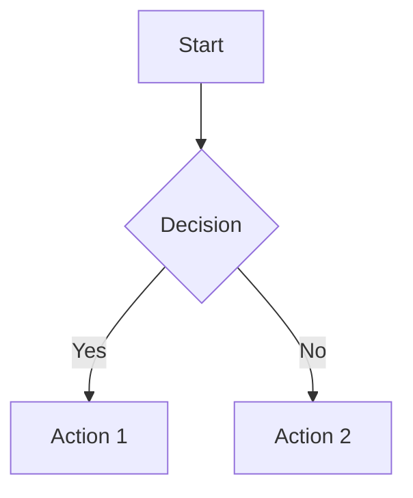
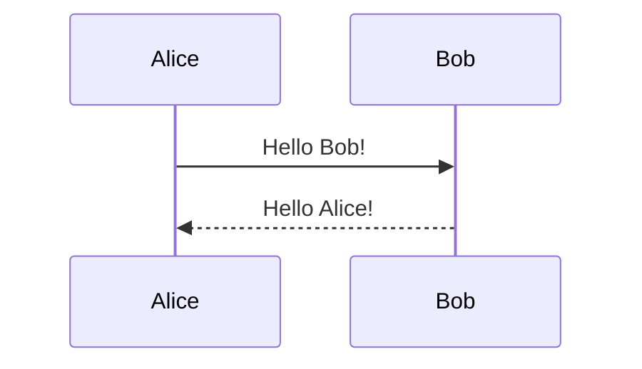

# Markdown Editor - Complete User Manual

*Version 3.3 Development - A comprehensive guide to the current markdown editing experience*

---

## Table of Contents

1. [Getting Started](#getting-started)
2. [Interface Overview](#interface-overview)
3. [Core Features](#core-features)
4. [Advanced Functionality](#advanced-functionality)
5. [Tab Management System](#tab-management-system)
6. [Context Menus](#context-menus)
7. [Plugin System](#plugin-system)
8. [Performance & Monitoring](#performance--monitoring)
9. [Customization Options](#customization-options)
10. [Technical Capabilities and Limitations](#technical-capabilities-and-limitations)
11. [Troubleshooting](#troubleshooting)
12. [Appendix](#appendix)

---

## Getting Started

Welcome to the Markdown Editor, a powerful application designed to provide you with a professional markdown editing experience. This manual covers all features including the new context menu system, plugin architecture, and performance monitoring dashboard.

### Initial Setup

The application requires no complex configuration to get started. Simply launch the executable file, and you're ready to begin editing. The interface automatically adapts to your system's theme preferences.

**Current development highlights:**
- Lightweight CodeMirror editor and component-based startup
- Pure Markdown and Extended rendering modes
- Dedicated Plugin Manager with persistent plugin settings
- Lazy local KaTeX renderer with strict false-positive protection
- Per-document tab, scroll, and unsaved-change state

---

## Interface Overview

### Main Window Layout

The main window features a sophisticated multi-pane layout with intelligent tab management, context-sensitive menus, and real-time performance monitoring.

### Toolbar Components

The toolbar includes:
- **File Operations**: New, Open, Save, Save As with dropdown options
- **Mode Controls**: Code, Preview, Split mode buttons
- **Editing Tools**: Undo, Redo, Find & Replace
- **View Controls**: Theme toggle, Distraction-free mode, Settings
- **Export Options**: HTML export, PDF printing
- **Optional Quick Controls**: Markdown rendering and Pinned Tabs controls can be pinned after Export; narrow windows combine them under Quick
- **Consistent Commands**: Every toolbar button, dropdown item, and overflow menu entry runs the same command as its keyboard shortcut, so the theme toggle, mode buttons, and formatting tools behave identically from either entry point
- **Markdown Toolbar Fit**: The Markdown toolbar stays inside the code pane. As the pane narrows — a vertical split, a portrait monitor, or a resized window — formatting groups move into the **More** menu a group at a time, while **More** and **Find & Replace** stay pinned at the right edge
- **More Menu**: **More** appears only once something no longer fits and lists exactly the commands the toolbar had to give up, so it never duplicates a button you can already see. It sits beside **Find & Replace** at the right edge

### Welcome Screen

- **New and Open**: Start a document or select existing files without entering an editor mode first
- **Help and About**: Open the same application modals used by the toolbar
- **Settings**: Opens fully refreshed application, performance, system, and plugin information, just like `Ctrl+,` and the toolbar Settings button
- **Clear History**: Removes the recent-file list without closing current or persisted tabs

### Enhanced Tab System

The tab system now supports:
- **Smart Dropdown**: Shows 9 most recent tabs with numbers
- **Tab Modal**: Search and navigate all open tabs (Ctrl+Shift+M), reachable from the status bar whenever more than one document is open
- **Context Menus**: Right-click for advanced tab operations
- **Performance Virtualization**: Handles 50+ tabs efficiently
- **Consistent Document State**: Open, reload, edit, save, and dirty-state events update the active tab, toolbar, and optional pinned tabs together
- **Consistent Editor State**: Editing updates the active tab and Preview immediately, while cursor position remains attached to the correct document when switching tabs

### Retro Startup Sound

When the Retro theme and Startup Sound setting are enabled, the bundled local clip is loaded and decoded before playback begins. This can introduce a brief delay on the first launch after rebuilding, but prevents the sound from pausing while the application is still loading. Use **Settings → Appearance → Startup Sound → Test** to replay the cached clip.

---

## Core Features

### Multi-Mode Editing Experience

#### Code Mode
- **CodeMirror Integration**: Lightweight editing suitable for lower-end Windows and Linux systems
- **Syntax Highlighting**: Full markdown syntax support
- **Search and Replace**: Ctrl+F toggles Find and Ctrl+H toggles Replace without changing the editor layout
- **Editing History**: Ctrl+Z and Ctrl+Y perform single-step undo and redo
- **Formatting Toggles**: Bold and italic may be combined; toggling Italic on `***bold italic***` retains the bold layer instead of adding more asterisks
- **Scroll Position Memory**: Remembers cursor and scroll positions

#### Preview Mode
- **GitHub-Flavored Markdown**: Standard-compliant rendering
- **Preview Commands**: The context menu can reload the active file, explicitly synchronize from Code, export, or restart the application
- **Interactive Coordination**: Task changes, external links, renderer status, and scroll restoration remain synchronized with the active document
- **Reliable Task Identity**: Preview checkboxes retain their source-line identity, so similar or repeated task labels update only the checkbox that was clicked
- **Real-time Updates**: Live preview as you type
- **Interactive Elements**: Clickable task lists, working links
- **Context Menu**: Right-click for reload, sync, export options
- **Zoom Controls**: 50%-300% zoom with keyboard shortcuts

#### Split Mode
- **Synchronized Views**: Code and preview side-by-side
- **Coordinated Scrolling**: Code and preview retain the same document-relative position across mode changes
- **Adjustable Split**: Drag the divider to resize pane widths vertically or pane heights when the Horizontal Split plugin is active
- **Unified Operations**: Actions affect both panes appropriately

### File Operations

#### Opening Files
- **Traditional Dialog**: Ctrl+O opens file picker
- **Drag & Drop to open**: Drop a Markdown or text file on the welcome screen, toolbar, or Preview pane to open it. Dropping an already-open path activates its existing tab.
- **Drag & Drop in Code mode**: With a document open, drop files into the Code editor to insert their names or native paths at the drop position.
- **File Associations**: Double-click .md files in explorer
- **Multiple Files**: Each file opens in new tab

#### Saving Files
- **Quick Save**: Ctrl+S saves current file
- **Save As**: Ctrl+Shift+S with location picker
- **Auto-save Indicators**: Visual cues for unsaved changes
- **Dropdown Options**: Save with encoding options

#### Closing Documents and the Application

- **Close a document**: If the document has unsaved changes, the application asks whether to close without saving or return to the document.
- **Close the application**: No save prompt is shown. Open tabs, modified content, dirty indicators, cursor positions, and scroll positions are retained in the local session and restored when the application is launched again.
- **Important**: Session recovery protects work between application launches, but it does not replace saving important documents to a file.

---

## Advanced Functionality

### Mathematical Expression Support

KaTeX is a bundled local renderer plugin. It is enabled by default for compatibility, but its runtime and styles remain unloaded until Extended rendering encounters configured math syntax. No CDN or network service is used.

```latex
$$\int_{-\infty}^{\infty} e^{-x^2} dx = \sqrt{\pi}$$

Inline math: $E = mc^2$

Matrix notation: $\begin{pmatrix} a & b \\ c & d \end{pmatrix}$
```

A `$$` block may span as many lines as you need. Matrices, `align`, `cases`, and any environment containing a line that is just `=` render as one formula:

```latex
$$
\begin{pmatrix} a & b \\ c & d \end{pmatrix}
\begin{pmatrix} x \\ y \end{pmatrix}
=
\begin{pmatrix} ax + by \\ cx + dy \end{pmatrix}
$$
```

Inline formulas match the size of the sentence around them; display blocks stay slightly larger. A `$` inside a code fence or inline code is always literal, wherever it appears.

#### Rendering mode requirements

- **Pure Markdown** leaves all dollar-delimited text unchanged and never invokes KaTeX.
- **Extended** allows enabled renderer plugins to process their syntax.
- Disabling the KaTeX plugin immediately returns formulas to literal Markdown.

#### KaTeX plugin settings

Open **Settings → Plugins → Manager → KaTeX Math Renderer**. Hover over any configuration row for one second to see its explanation.

- **Detection — Strict**: Requires recognizable mathematical syntax. Prices such as `$5`, shell variables such as `$PATH`, ordinary prose, escaped dollars, and text inside code are ignored.
- **Detection — Permissive**: Accepts any correctly paired dollar-delimited text for compatibility with older documents.
- **Inline `$…$`**: Enables or disables single-dollar inline formulas independently.
- **Display `$$…$$`**: Enables or disables double-dollar block formulas independently.
- **Invalid Formulas — Keep Source**: Leaves invalid expressions unchanged.
- **Invalid Formulas — Show Warning**: Displays KaTeX's visible error output.
- **Bundled Runtime**: A read-only status that shows Not Loaded until real math is encountered, then reports the bundled local KaTeX version.

System Info reports **Disabled** only when the plugin is disabled or unavailable, **Not Loaded** when it is enabled but still lazy, and **Loaded (version)** after the first formula is rendered.

### Diagram Creation

Mermaid is a bundled local renderer plugin. It is enabled by default, but its runtime and feature styles remain unloaded until Extended rendering encounters a fenced code block labelled `mermaid`. No CDN or external rendering service is used. In Pure Markdown mode, or while the plugin is disabled, the diagram remains a normal readable code block.

Mermaid supports multiple diagram types:


```mermaid
graph TD
    A[Start] --> B{Decision}
    B -->|Yes| C[Action 1]
    B -->|No| D[Action 2]
```


```mermaid
sequenceDiagram
    participant A as Alice
    participant B as Bob
    A->>B: Hello Bob!
    B-->>A: Hello Alice!
```

#### Mermaid plugin settings

Open **Settings → Plugins → Manager → Mermaid Diagram Renderer**. Hover over any configuration row for one second to see its explanation.

- **Theme — Application**: Uses Mermaid's dark theme when the application is dark and its default theme otherwise.
- **Theme — Default/Dark/Neutral/Forest**: Keeps that fixed diagram theme regardless of the application theme.
- **Maximum Width**: Fits flowcharts and pie charts to the preview width; disable it to preserve Mermaid's intrinsic width.
- **Invalid Diagrams — Keep Source**: Restores a readable `mermaid` code block when Mermaid rejects the diagram.
- **Invalid Diagrams — Show Warning**: Displays the source and Mermaid's error message.
- **Security — Strict**: This is intentionally fixed. Mermaid uses strict security, and the application sanitizes and parses the generated SVG into DOM nodes before displaying it.
- **Bundled Runtime**: A read-only status that shows Not Loaded until the first Mermaid fence is encountered, then reports the pinned Mermaid version without fetching package metadata or accessing the network.

System Info reports **Disabled** only when the Mermaid plugin is disabled or unavailable, **Not Loaded** while the enabled runtime remains lazy, and **Loaded (version)** after the first diagram is rendered.

### Interactive Task Lists

Task lists are fully interactive in Preview mode:

```markdown
- [x] Completed task
- [ ] Pending task
- [ ] Another pending task
  - [x] Nested completed task
  - [ ] Nested pending task
```

Click checkboxes in Preview mode to toggle states. Changes automatically sync to source markdown. Checked task text uses the same subdued appearance for top-level and nested tasks; checking a parent does not change the appearance of its children.

### Export and Sharing

#### HTML Export
- **Complete Packages**: Includes CSS, JavaScript, and assets
- **Standalone Files**: Self-contained HTML documents
- **Syntax Highlighting**: Preserved in exported files
- **Mathematical Expressions**: Fully rendered in output

#### PDF Export
- **Print Integration**: Uses system print dialog
- **Layout Preservation**: Maintains formatting and structure
- **Cross-platform**: Works on Windows, macOS, and Linux

---

## Tab Management System

### Smart Tab Organization

#### Tab Dropdown
- **Recent 9 Tabs**: Shows most recently accessed files
- **Numbered Access**: Alt+1-9 for quick switching
- **Sequential Access**: Ctrl+Tab and Ctrl+Shift+Tab move forward and backward with wraparound
- **Visual Indicators**: Shows dirty state, active tab
- **Tab Manager**: "More" opens the full tab manager. It appears as soon as a second document is open, since the manager offers search, reordering, and per-tab commands well before the dropdown runs out of room

#### Tab Modal (Ctrl+Shift+M)
- **Search Functionality**: Filter tabs by filename
- **Keyboard Navigation**: Arrow keys and Enter to select
- **Batch Operations**: Close multiple tabs
- **Performance Info**: Shows tab count and memory usage

### Tab Operations

#### Context Menu (Right-click)
- **Close Tab**: Close current tab
- **Close Others**: Close all except current
- **Close All**: Close all tabs
- **Duplicate Tab**: Create copy of current tab
- **Reveal in Explorer**: Show file in system file manager
- **Move to Position**: Move tab to specific position (1-9)
- **Command Ownership**: Context commands update the same tab collection used by pinned tabs, the status-bar list, and session restoration

#### Advanced Features
- **Tab Persistence**: Restores all tabs on app restart
- **Scroll Position Memory**: Remembers position per tab per mode
- **Dirty State Tracking**: Visual indicators for unsaved changes
- **Performance Virtualization**: Optimizes memory for 15+ tabs

---

## Context Menus

### Preview Mode Context Menu

Right-click in Preview mode for:

#### File Operations
- **Reload File**: Refresh file from disk
- **Sync from Code**: Update preview with current editor content

#### Export Options
- **Export to HTML**: Save as standalone HTML file
- **Export to PDF**: Print/save as PDF document

#### System Operations
- **Restart Application**: Clean restart with tab restoration

### Tab Context Menu

Right-click on tabs for:

#### Tab Management
- **Close Tab**: Close selected tab
- **Close Others**: Close all other tabs
- **Close All**: Close all tabs
- **Duplicate Tab**: Create identical tab

#### Navigation
- **Reveal in Explorer**: Show file location
- **Move to Position**: Reorder tabs (positions 1-9)

---

## Plugin System

### Plugin Architecture

The application features an extensible plugin system for enhanced functionality:

#### Plugin Management
- **Settings Integration**: Use Settings > Plugins for the system switch and concise plugin controls, then select Manager for plugin-specific tabs
- **Enable/Disable**: Toggle plugins without restarting; repeat clicks do not leave controls stuck in transitional states
- **Status Indicators**: Visual feedback for plugin state
- **Reload and Reset**: Reload plugins while preserving choices, or reset one plugin without affecting another

#### Default Configuration
- **KaTeX Compatibility Default**: KaTeX is enabled the first time this version discovers it, preserving existing Extended-rendering behavior
- **Mermaid Compatibility Default**: Mermaid is enabled the first time this version discovers it, preserving existing Extended-rendering behavior
- **User Choice Wins**: Once a plugin is enabled or disabled, that choice persists across restarts
- **Master Pause**: The plugin system can pause all plugin code without forgetting which plugins should resume
- **State Persistence**: Plugin preferences saved across sessions

#### Plugin Development
- **API Access**: Comprehensive plugin API for extensions
- **Event System**: Hook into application events
- **UI Integration**: Add custom UI elements
- **File Operations**: Access to file system through secure API

### Bundled Plugins

- **KaTeX Math Renderer**: Lazy local math rendering and syntax-detection controls
- **Mermaid Diagram Renderer**: Lazy local diagrams with theme, sizing, failure, security, and runtime controls
- **Horizontal Split**: Vertical/horizontal split orientation, toolbar visibility, and pane order

---

## Performance & Monitoring

### Performance Dashboard

Access via Settings > Performance for real-time monitoring:

#### System Metrics
- **Memory Usage**: Current RAM consumption
- **Tab Count**: Active and virtualized tabs
- **Startup Time**: Application launch performance
- **Mode Switch Time**: View mode change performance
- **File Operation Time**: Load/save operation speed

#### Performance Status
- **Good**: Green indicator, optimal performance
- **Warning**: Yellow indicator, elevated resource usage
- **Critical**: Red indicator, performance issues detected

#### Optimization Tools
- **Memory Cleanup**: Force garbage collection
- **Tab Virtualization**: Optimize inactive tabs
- **Cache Management**: Clear temporary data
- **Performance Reset**: Restore optimal settings

### Performance Characteristics

#### Benchmarks
- **Startup Time**: <60ms (98.5% improvement over v1.0)
- **File Operations**: <500ms for typical files
- **Mode Switching**: <35ms between views
- **Tab Switching**: <35ms navigation time
- **Memory Usage**: Stable with leak prevention

#### Optimization Features
- **Smart Virtualization**: Inactive tabs use minimal memory
- **Lazy Loading**: Components load on demand
- **Memory Pressure Detection**: Automatic cleanup when needed
- **Performance Monitoring**: Real-time resource tracking

---

## Customization Options

### Startup Splash

The splash screen can be enabled or disabled and shown for one to five seconds from Settings. Its animation is bundled with the application and works offline in both development and installed production builds.

### Theme Selection

Four carefully crafted themes:

#### Light Theme
- **Clean Interface**: Bright, professional appearance
- **High Contrast**: Excellent readability
- **Daytime Optimized**: Reduces eye strain in bright environments

#### Dark Theme
- **Modern Aesthetic**: Low-contrast, easy on eyes
- **Extended Sessions**: Ideal for long editing periods
- **Low-light Environments**: Perfect for evening work

#### Retro Theme
- **Windows 3.1 Style**: Authentic vintage computing experience
- **MS Sans Serif Font**: Period-appropriate typography
- **3D Interface Elements**: Classic raised/inset button styling
- **Nostalgic Color Scheme**: Gray backgrounds with navy accents
- **Readable Code Blocks**: Fenced code uses a 14px monospace font while normal preview text remains compact

#### High Contrast Theme
- **Maximum Separation**: Strong foreground, background, and border contrast
- **Accessible Syntax Colors**: Distinct editor and preview code highlighting

### Font and Display Settings

#### Editor Font Size
- **Range**: 10px to 24px
- **Keyboard Shortcuts**: Ctrl+Mouse wheel for quick adjustment
- **Per-mode Settings**: Different sizes for Code and Preview
- **Accessibility**: Large fonts for better readability

#### Preview Zoom
- **Range**: 50% to 300%
- **Independent Control**: Separate from editor font size
- **Keyboard Shortcuts**: Ctrl+=/- for zoom control
- **Reset Function**: Ctrl+0 returns to 100%

### Toolbar Customization

#### Size Options
- **Small**: Maximizes editing space, compact buttons
- **Medium**: Balanced approach, standard sizing
- **Large**: Enhanced accessibility, bigger touch targets

Every theme, including Retro, follows the size you choose, and buttons grow to fit their label rather than letting text or icons spill outside.

#### Page Size

With centered layout enabled, content is constrained to a page width: A4, Letter, or A3. The choice applies immediately and is used in distraction-free mode too.

Centered layout applies in Code and Preview. It is suspended in Split, where two panes share the window and narrowing each to a page width would leave two thin columns; it returns when you leave Split.

#### Layout Options
- **Main Toolbar**: File operations and mode controls
- **Markdown Toolbar**: Formatting and editing tools
- **Status Bar**: Information and quick controls

#### Settings Consistency
- **One Source of Truth**: The Settings modal always shows the values currently in effect, whichever entry point opened it — toolbar, `Ctrl+,`, welcome screen, or returning from the Plugin Manager
- **Live Updates**: Toggling the Markdown toolbar with `Ctrl+Shift+/` while Settings is open updates its On/Off buttons immediately
- **Theme Agreement**: Settings highlights the theme that is actually applied, whether you chose it in Settings, with the toolbar theme button, or with `Ctrl+T`

---

## Technical Capabilities and Limitations

### Markdown Rendering Engine

#### Supported Features
- **GitHub-Flavored Markdown**: Full GFM compatibility
- **Extended Syntax**: Tables, task lists, strikethrough
- **Code Highlighting**: Syntax highlighting for 100+ languages
- **Link Processing**: Automatic URL detection and linking
- **Image Support**: Local and remote image rendering

#### Advanced Extensions
- **KaTeX Mathematics**: Lazy, plugin-owned LaTeX-style mathematical expressions
- **Mermaid Diagrams**: Text-based diagram creation
- **Interactive Elements**: Clickable task lists and links
- **Custom Styling**: Theme-aware rendering

### Performance Architecture

#### Frontend Technologies
- **CodeMirror**: Lightweight code editing engine
- **Marked.js**: Fast markdown parsing
- **KaTeX**: Mathematical typesetting
- **Mermaid.js**: Diagram rendering
- **Staged Bootstrap**: Loads the maintained component graph and registered plugins without legacy application entry points or sample code
- **Highlight.js**: Syntax highlighting
- **Local Asset Set**: Keeps only artwork and audio used by the native application; the welcome screen and browser shell share a compact branded icon

#### Backend Technologies
- **Rust/Tauri**: Native performance with web flexibility
- **File System Integration**: Secure file operations
- **Native Window Lifecycle**: Window-close session persistence and files forwarded from a second launch are handled by a focused controller with disposable listeners
- **Memory Management**: Efficient resource utilization
- **Cross-platform**: Windows, macOS, Linux support

### Security Features

#### Sandboxed Operations
- **File Access Control**: Limited to user-selected files
- **Content Security Policy**: Protection against malicious content
- **Plugin Validation**: Secure plugin loading and execution
- **No Network Access**: Offline operation for privacy

#### Data Protection
- **Local Storage**: All data remains on user's device
- **No Telemetry**: No usage data collection
- **Secure Plugins**: Controlled plugin execution environment

---

## Troubleshooting

### Common Issues and Solutions

#### Performance Issues
- **High Memory Usage**: Use Performance Dashboard to monitor and optimize
- **Slow Startup**: Check for corrupted settings, reset if necessary
- **Lag in Large Files**: Enable virtualization in settings
- **Plugin Conflicts**: Disable problematic plugins

#### File Operation Problems
- **Files Won't Open**: Check file permissions and encoding
- **Save Failures**: Verify write permissions and disk space
- **Association Issues**: Re-run installer with admin privileges
- **Encoding Problems**: Use Save As with specific encoding

#### Rendering Issues
- **Math Not Displaying**: Confirm Extended mode, enable the KaTeX plugin, verify its inline/display setting, and check formula validity
- **Dollar Text Rendered as Math**: Select Strict detection in the KaTeX plugin; escape intentional currency delimiters with `\$` where necessary
- **Diagrams Not Rendering**: Confirm Extended mode, enable the Mermaid plugin, verify the fence is labelled `mermaid`, and check the Invalid Diagrams setting for a readable error
- **Theme Problems**: Reset theme settings to default
- **Font Issues**: Clear font cache and restart

### Advanced Troubleshooting

#### Performance Debugging
1. Open Performance Dashboard (Settings > Performance)
2. Monitor resource usage during problem scenarios
3. Use memory cleanup tools if needed
4. Check for plugin interference
5. Reset performance settings if necessary

#### Plugin Issues
1. Disable all plugins to isolate problems
2. Enable plugins one by one to identify conflicts
3. Check plugin compatibility with current version
4. Use plugin refresh to reload without restart
5. Reset plugin configuration if needed

---

## Appendix

### Complete Keyboard Shortcuts

#### File Operations
- `Ctrl+N` - New file
- `Ctrl+O` - Open file
- `Ctrl+S` - Save file
- `Ctrl+Shift+S` - Save as
- `Ctrl+W` - Close tab
- `F5` - Reload file

#### View Modes
- `Ctrl+Shift+1` - Code mode
- `Ctrl+Shift+2` - Preview mode
- `Ctrl+Shift+3` - Split mode

#### Tab Navigation
- `Alt+1-9` - Switch to numbered tab
- `Ctrl+Tab` - Next tab
- `Ctrl+Shift+Tab` - Previous tab
- `Ctrl+Shift+M` - Open tab modal
- `Ctrl+W` - Close current tab

#### Editor Controls
- `Ctrl+1` / `Ctrl+2` / `Ctrl+3` - Heading 1/2/3 in Code mode
- `Ctrl+F` - Toggle Find
- `Ctrl+H` - Toggle Find and Replace
- `Ctrl+Z` - Undo
- `Ctrl+Y` - Redo
- `Ctrl+=` - Zoom in (Preview)
- `Ctrl+-` - Zoom out (Preview)
- `Ctrl+0` - Reset zoom
- `Ctrl+P` - Print/export PDF
- `Ctrl+Shift+E` - Export HTML

#### Application
- `Ctrl+T` - Toggle theme
- `Ctrl+,` - Settings
- `F1` - Help
- `F11` - Fullscreen
- `Shift+F11` - Distraction-free mode
- `Esc` - Close modals/exit modes

#### Mouse Shortcuts
- `Ctrl+Mouse Wheel` - Font size (Code) / Zoom (Preview)
- `Ctrl+Shift+Mouse Wheel` - Switch modes
- `Alt+Mouse Wheel` - Switch tabs

### System Requirements

#### Minimum Requirements
- **Windows**: Windows 10 (1903+)
- **macOS**: macOS 10.13 (High Sierra+)
- **Linux**: Ubuntu 18.04, Debian 10, or equivalent
- **RAM**: 4GB minimum
- **Storage**: 100MB free space
- **Display**: 1024x768 resolution

#### Recommended Specifications
- **RAM**: 8GB for optimal performance with large files
- **Storage**: SSD for faster file operations
- **Display**: 1920x1080 or higher for best interface experience
- **CPU**: Multi-core processor for better plugin performance

### File Format Support

#### Input Formats
- `.md` - Standard markdown
- `.markdown` - Alternative extension
- `.mdown` - Markdown variant
- `.mkd` - Markdown variant
- `.text` - Plain text files

#### Export Formats
- **HTML**: Complete with CSS/JavaScript
- **PDF**: Via system print dialog
- **Markdown**: Plain text export

### Plugin API Reference

#### Core API Methods
- `registerCommand()` - Add custom commands
- `registerMenuItem()` - Add menu items
- `onFileOpen()` - File open event handler
- `onFileSave()` - File save event handler
- `onModeChange()` - Mode change event handler

#### UI Integration
- `addToolbarButton()` - Custom toolbar buttons
- `addStatusBarItem()` - Status bar elements
- `showNotification()` - User notifications
- `createModal()` - Custom modal dialogs

---

*This manual represents the current development feature set. Developers should use `TECHNICAL_DOCUMENTATION.md` for architecture and `BUILD_GUIDE.md` for build and release instructions.*

**Document Version**: 3.3 Development

**Last Updated**: August 2026

**Application Version**: 3.2.1 development branch
