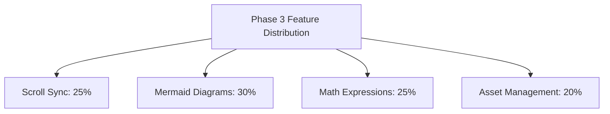
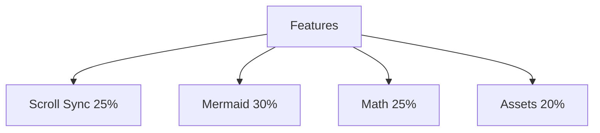

# Mermaid Alternative - Use Flowchart

```mermaid
flowchart TD
    A[Phase 3 Feature Distribution]
    A --> B[Scroll Sync: 25%]
    A --> C[Mermaid Diagrams: 30%]
    A --> D[Math Expressions: 25%]
    A --> E[Asset Management: 20%]
```

## Or use a simple graph:

```mermaid
graph TD
    A[Features] --> B[Scroll Sync 25%]
    A --> C[Mermaid 30%]
    A --> D[Math 25%]
    A --> E[Assets 20%]
```